<style>
  .mermaid svg { max-height: 420px !important; width: auto !important; }
  .slidev-code { font-size: 0.78em !important; line-height: 1.3 !important; }
  .slidev-layout { font-size: 0.7em !important; }
  .slidev-layout h1 { font-size: 1.6em !important; }
  .slidev-layout h3 { font-size: 1.1em !important; }
</style>

---

# Vstupné dáta: `DebugProcessImpl.java` (IntelliJ)

Reálny commit `7655200f` · 2108 riadkov · 133 metód

<div class="grid grid-cols-2 gap-8 mt-4">
<div>

**SonarQube našiel 3 smelly:**

| Smell | Pravidlo | Závažnosť |
|-------|----------|-----------|
| God Class (GC) | S1200 | HIGH = 3 |
| Long Method (LM) | S138 | HIGH = 3 |
| Long Param List (LPL) | S107 | MEDIUM = 2 |

$h(S_0) = 3 + 3 + 2 = \mathbf{8}$ — celková závažnosť, to je náš cieľ znížiť na 0

$$PD_i = w \cdot \text{sev}(s_i) + \sum\text{pos\_out}^{\text{conc}} - \sum\text{neg\_out}^{\text{abs}}$$

$w=0.5$, pos\_out = smelly v tom istom súbore ktoré sa vyriešia ako vedľajší efekt, neg\_out = riziká z katalógu závislostí

| Smell | $w{\cdot}sev$ | pos\_out | neg\_out | **PD** |
|-------|--------------|----------|----------|--------|
| GC | $0.5{\cdot}3=1.5$ | +1 (FE, co-located LM) | −2 (môže vytvoriť LM, II) | **0.5** |
| LM | $0.5{\cdot}3=1.5$ | +1 (FE, co-located GC) | −2 (môže vytvoriť LM, LPL) | **0.5** |
| LPL | $0.5{\cdot}2=1.0$ | +1 (DC, cross-file) | −1 (DataClass riziko) | **1.0** |

</div>
<div>

**Graf závislostí — počiatočný stav:**

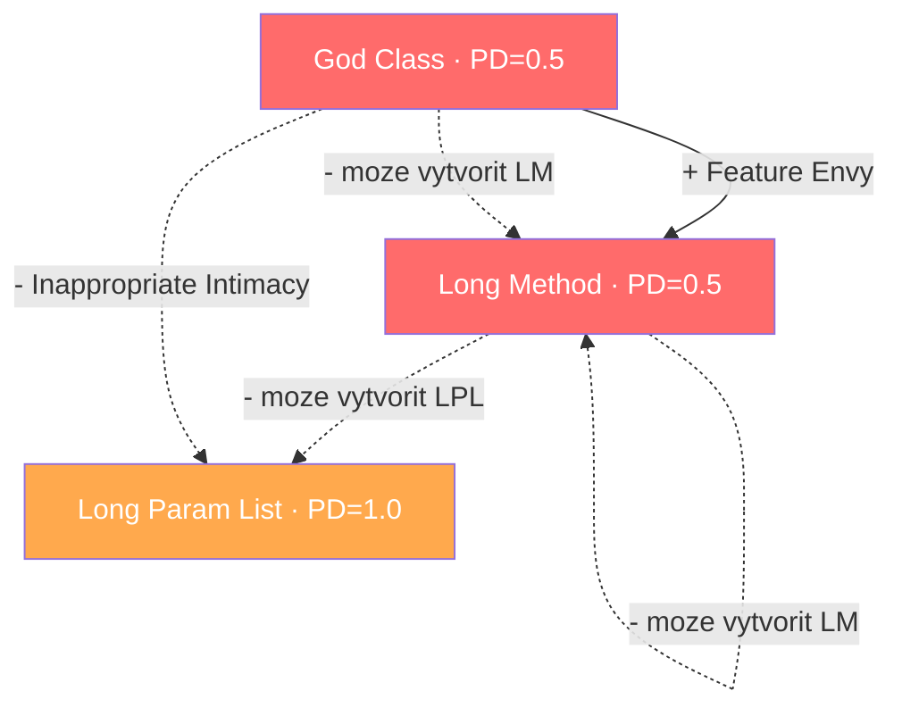

</div>
</div>

---

# Počiatočný stav — oba algoritmy štartujú tu

<div class="grid grid-cols-2 gap-8 mt-6">
<div>

### Greedy
Zoberie smell s najvyšším PD. GC a LM sú zaviazané na PD=0.5, takže greedy rozhoduje podľa závažnosti — **vezme GC**.

</div>
<div>

### BFS
Nič nerobí hneď. Najprv simuluje všetky 3 možné prvé kroky a vypočíta $h$ výsledného stavu. Vyberie ten krok, po ktorom je $h$ najnižšie.

</div>
</div>

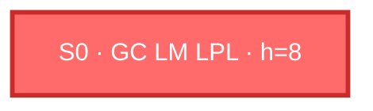

---

# Greedy — krok 1: Extract Class na God Class

**Akcia:** rozdeliť `DebugProcessImpl` (133 metód → 2 triedy)

<div class="grid grid-cols-2 gap-6">
<div>

```java {1-6|7-14}
// PRED: všetko v jednej triede
class DebugProcessImpl {
  // 133 metód — God Class
  void runToCursor(...) { /* 80+ riadkov */ }
  void suspend(...) { ... }
  // + 131 dalšich ...
}

// PO: extrahovaná trieda
class DebugProcessImpl {
  // jadro zostáva
}
class SuspendManagerImpl {   // NOVÁ
  // orchestračné metódy
  // pristupuje k 47 privátnym poliam rodiča → II
}
```

</div>
<div>

**Graf závislostí po kroku 1 greedy:**

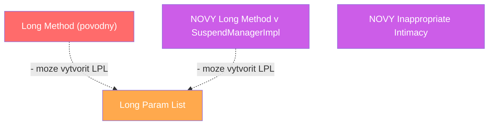

$h(S_1^G) = 3 + 2 + 3 + 2 = \mathbf{10}$ — horšie ako na začiatku

GC vyriešený ✅ ale **2 nové smelly** 💥 — negatívne závislosti sa aktivovali, lebo LM bol stále prítomný keď sme refaktorovali GC

</div>
</div>

---

# BFS — krok 1: najprv simulácia všetkých vetiev

**BFS ešte nič nerobí — simuluje čo sa stane pri každom možnom prvom kroku:**

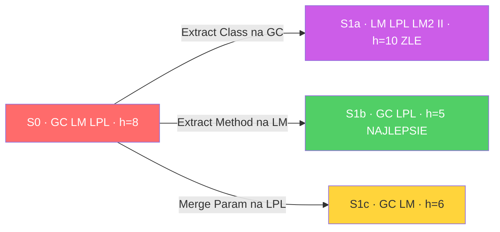

<div class="mt-4">

**BFS vyberie: Extract Method na LM** → $h = 5$ (najnižšie)

**Akcia:** extrahovanie `checkRemap()` z `getLine()`/`getOffset()` — presne to čo urobil developer v commite

Keď LM zmizne, negatívna závislosť GC → II sa už nemôže aktivovať — podmienka pre jej spustenie je práve existencia LM v rovnakej triede.

</div>

---

# BFS — výsledok kroku 1

**Akcia:** extrahovanie `checkRemap()` z Long Method

<div class="grid grid-cols-2 gap-6">
<div>

```java {1-10|12-22}
// PRED: getLine() — všetko inline
int getLine(Document doc, int offset) {
  SourcePosition pos = getSourcePosition();
  if (pos == null) return -1;
  RemappedSourcePosition remap =
    RemappedSourcePosition.create(pos);
  if (remap != null && remap.isValid()) {
    return remap.getLine();
  }
  return pos.getLine();
}

// PO: extrahovaná metóda
int getLine(Document doc, int offset) {
  SourcePosition pos = getSourcePosition();
  if (pos == null) return -1;
  return checkRemap(pos);    // EXTRAHOVANÉ
}
private int checkRemap(SourcePosition pos) {
  RemappedSourcePosition r =
    RemappedSourcePosition.create(pos);
  return (r != null && r.isValid())
    ? r.getLine() : pos.getLine();
}
```

</div>
<div>

**Graf závislostí po kroku 1 BFS:**

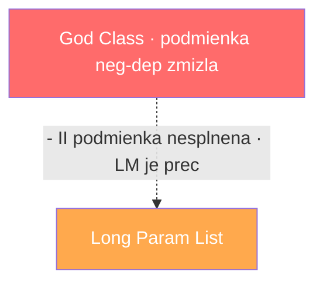

$h(S_1^B) = 3 + 2 = \mathbf{5}$ ↓

LM vyriešený ✅ · žiadne nové smelly · GC teraz môžeme bezpečne rozbiť

</div>
</div>

---

# Greedy — kroky 2–5: pomalé upratovanie

```mermaid
graph LR
  G0["S0 · GC LM LPL · h=8"]
  G1["S1 · LM LPL LM2 II · h=10"]
  G2["S2 · LM LM2 II · h=8"]
  G3["S3 · LM2 II · h=5"]
  G4["S4 · II · h=2"]
  G5["S5 · hotovo · h=0"]

  G0 -->|"Extract Class (GC)"| G1
  G1 -->|"Merge Param (LPL)"| G2
  G2 -->|"Extract Method (LM)"| G3
  G3 -->|"Extract Method (LM2)"| G4
  G4 -->|"Fix II"| G5

  style G0 fill:#ff6b6b,color:#fff
  style G1 fill:#cc5de8,color:#fff
  style G2 fill:#cc5de8,color:#fff
  style G3 fill:#ffa94d,color:#fff
  style G4 fill:#ffd43b,color:#333
  style G5 fill:#51cf66,color:#fff
```

**5 krokov · 2 neplánované smelly (LM2, II) · peak h=10**

---

# BFS — kroky 2–3: čisté dokončenie

**Stav $S_1^B$ = {GC, LPL}** · prepočítame PD po zmiznutí LM:

| Smell | pos\_out | neg\_out | PD |
|-------|----------|----------|----|
| GC | 0 (FE je preč) | 0 (II podmienka nesplnená — LM zmizol) | $0.5{\cdot}3 = \mathbf{1.5}$ |
| LPL | 1 (DC cross-file) | 1 (DataClass) | $0.5{\cdot}2+1-1 = \mathbf{1.0}$ |

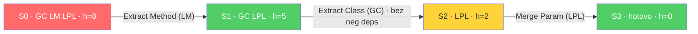

**3 kroky · 0 nových smellov · zhoduje sa so skutočnou sekvenciou developera**

---

# Porovnanie: DebugProcessImpl

<div class="grid grid-cols-2 gap-8">
<div>

### Greedy — vyberie GC ako prvý
```
S0: {GC, LM, LPL}              h=8
Krok 1: Extract Class (GC) →
        {LM, LPL, LM2, II}     h=10 ↑ 💥
Krok 2: Merge Param (LPL) →
        {LM, LM2, II}          h=8
Krok 3: Extract Method (LM) →
        {LM2, II}              h=5
Krok 4: Extract Method (LM2) →
        {II}                   h=2
Krok 5: Fix II →
        {}                     h=0 ✅
──────────────────────────────────
5 krokov · 2 nové smelly · peak h=10
```

</div>
<div>

### BFS — vyberie LM ako prvý
```
S0: {GC, LM, LPL}              h=8
Krok 1: Extract Method (LM) →
        {GC, LPL}              h=5 ✓
Krok 2: Extract Class (GC) →
        {LPL}                  h=2
Krok 3: Merge Param (LPL) →
        {}                     h=0 ✅
──────────────────────────────────
3 kroky · 0 nových smellov · peak h=5
```

BFS zhoduje sa so skutočnou sekvenciou developera. Greedy zobral GC skôr ako LM zmizol — práve tá kombinácia aktivuje negatívnu závislosť GC → II.

</div>
</div>

---

# Druhý príklad: `UkrainianTagger.java` (languagetool)

Reálny commit `bec15926` · rozklad God Class · 9 TP refaktoringov v orákulume

<div class="grid grid-cols-2 gap-8 mt-4">
<div>

**SonarQube našiel 3 smelly:**

| Smell | Závažnosť | Kde |
|-------|-----------|-----|
| God Class (GC) | HIGH = 3 | tagger + compound logika + helpery v jednej triede |
| Long Method (LM) | HIGH = 3 | `guessCompoundTag()` — 80+ riadkov analýzy slov |
| Duplicated Code (DC) | MEDIUM = 2 | regex patterny zdieľané naprieč concerns |

$h(S_0) = 3 + 3 + 2 = \mathbf{8}$

$$PD_i = w \cdot \text{sev}(s_i) + \sum\text{pos\_out}^{\text{conc}} - \sum\text{neg\_out}^{\text{abs}}$$

| Smell | $w{\cdot}sev$ | pos\_out | neg\_out | **PD** |
|-------|--------------|----------|----------|--------|
| GC | $0.5{\cdot}3=1.5$ | +1 (FE, co-located) | −2 (LM, II) | **0.5** |
| LM | $0.5{\cdot}3=1.5$ | +1 (DC, co-located) | −2 (LM, LPL) | **0.5** |
| DC | $0.5{\cdot}2=1.0$ | 0 (žiadne co-located smelly) | 0 (žiadne neg pravidlá) | **1.0** ← najvyššie |

</div>
<div>

**Graf závislostí — počiatočný stav:**

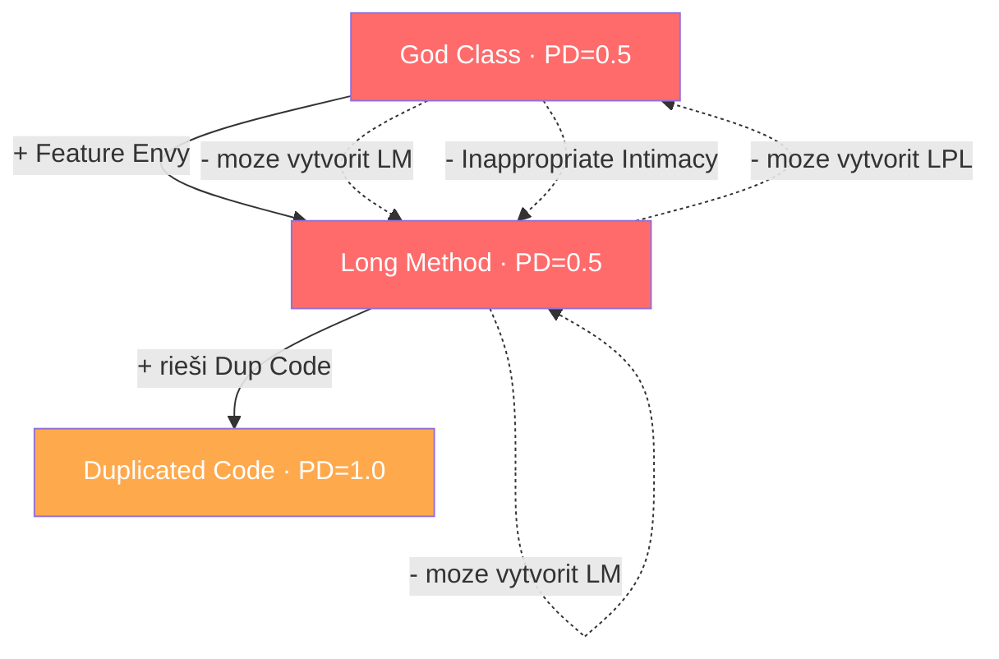

</div>
</div>

---

# UkrainianTagger — Greedy krok 1: vyberie GC

**GC a LM zaviazané na PD=0.5. Greedy vyberie GC (vyššia závažnosť, prvý v zozname).**

**Akcia:** Extract Class `CompoundTagger` z `UkrainianTagger`

<div class="grid grid-cols-2 gap-6">
<div>

```java {1-10|11-20}
// PRED: UkrainianTagger — God Class
class UkrainianTagger {
  // tagging logika
  // compound logika       ← patrí inam
  // attribute helpery     ← patrí inam
  // VIDMINKY_MAP, NUM_REGEX, CONJ_REGEX
  //                       ← duplikáty inde

  String guessCompoundTag(String word) {
    // 80+ riadkov analýzy
  }
}

// PO: extrahovaná — ale LM ide s ňou
class CompoundTagger {
  // compound logika
  // guessCompoundTag() MÁ STÁLE 80+ riadkov
  // pristupuje k internálom UkrainianTagger → II
}
class UkrainianTagger {
  CompoundTagger tagger; // delegácia
}
```

</div>
<div>

**Po greedy kroku 1:**

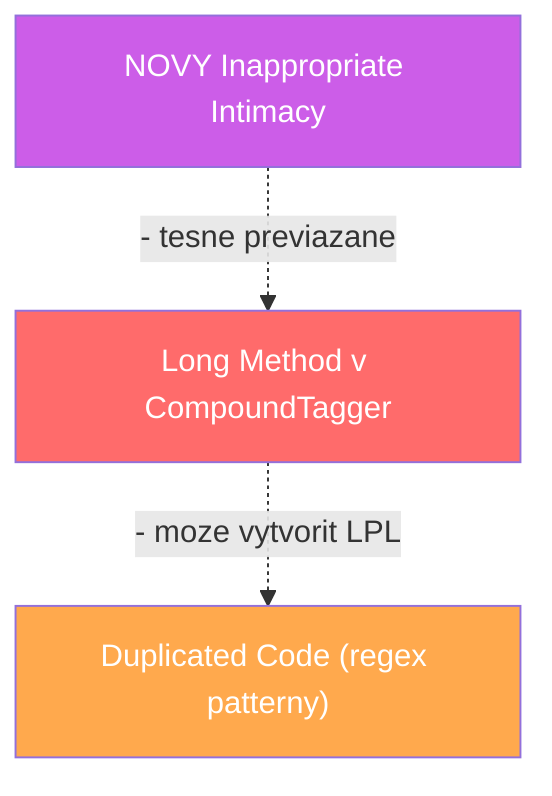

$h(S_1^G) = 3 + 2 + 2 = \mathbf{7}$

GC vyriešený ✅ ale **II vzniklo** 💥 — `CompoundTagger` pristupuje k internálom `UkrainianTagger` (VIDMINKY\_MAP atď.)

</div>
</div>

---

# UkrainianTagger — BFS krok 1: simulácia vetiev

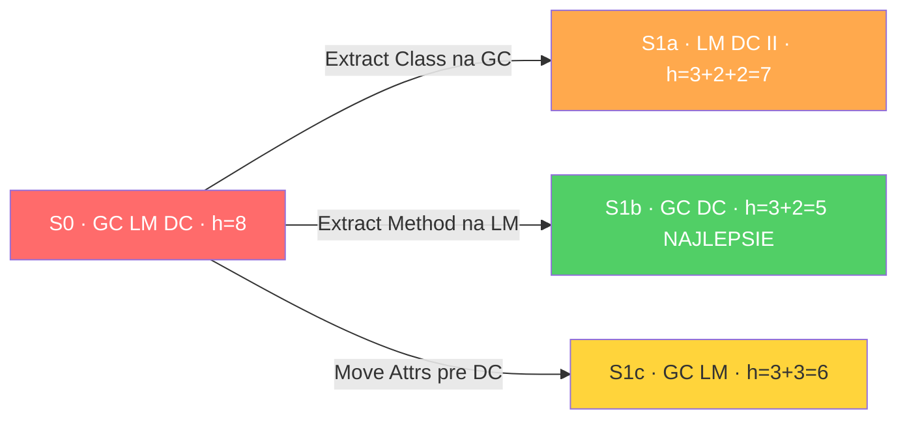

**BFS vyberie: Extract Method na LM** → $h = 5$ (najnižšie)

**Akcia:** extrahovanie `doGuessCompoundTag()` z `guessCompoundTag()`

Keď LM zmizne, GC sa dá rozbiť bez rizika — extrahovaná trieda nebude mať čo importovať z rodiča, pretože metóda je krátka a self-contained.

---

# UkrainianTagger — BFS kroky 2–3: čisté dokončenie

**Stav $S_1^B$ = {GC, DC}** · prepočítame PD po zmiznutí LM:

| Smell | pos\_out | neg\_out | PD |
|-------|----------|----------|----|
| GC | 0 (FE preč) | 0 (LM zmizol → podmienka nesplnená) | $0.5{\cdot}3 = \mathbf{1.5}$ |
| DC | 0 | 0 | $0.5{\cdot}2 = \mathbf{1.0}$ |

<div class="grid grid-cols-2 gap-6">
<div>

```java
// Krok 2: Extract Class bezpečne
// LM je preč → CompoundTagger
// nepotrebuje internály rodiča

class CompoundTagger {
  // len compound logika
  String guessCompoundTag(String word) {
    return doGuessCompoundTag(word); // krátke!
  }
}

// Krok 3: Move attributes pre DC
// VIDMINKY_MAP, NUM_REGEX, CONJ_REGEX
// presunuté do PosTagHelper
class PosTagHelper {
  static final Map VIDMINKY_MAP = ...;
  static final String NUM_REGEX = ...;
  static final String CONJ_REGEX = ...;
}
```

</div>
<div>

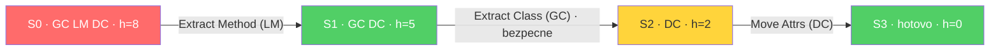

**3 kroky · 0 nových smellov**

Zhoduje sa so skutočnou sekvenciou commitu: najprv `doGuessCompoundTag`, potom `CompoundTagger`, potom atribúty do `PosTagHelper`.

</div>
</div>

---

# Porovnanie: UkrainianTagger

<div class="grid grid-cols-2 gap-8">
<div>

### Greedy — vyberie GC ako prvý
```
S0: {GC, LM, DC}               h=8
Krok 1: Extract Class (GC) →
        {LM, DC, II}           h=7  II vzniklo 💥
Krok 2: Extract Method (LM) →
        {DC, II}               h=4
Krok 3: Fix II →
        {DC}                   h=2
Krok 4: Move Attrs (DC) →
        {}                     h=0 ✅
────────────────────────────────
4 kroky · 1 nový smell (II) · peak h=7
```

</div>
<div>

### BFS — vyberie LM ako prvý
```
S0: {GC, LM, DC}               h=8
Krok 1: Extract Method (LM) →
        {GC, DC}               h=5 ✓
Krok 2: Extract Class (GC) →
        {DC}                   h=2  (II nevzniklo)
Krok 3: Move Attrs (DC) →
        {}                     h=0 ✅
────────────────────────────────
3 kroky · 0 nových smellov · peak h=5
```

Rovnaký vzor ako DebugProcessImpl — najprv Extract Method, potom Extract Class. Greedy zakaždým narazí na rovnaký problém: zoberie God Class kým LM existuje.

</div>
</div>

---

# Tretí príklad: `AbstractExternalFilter.java` (IntelliJ)

Reálny commit `7a4dab88` · RMiner orákulum · 7 typov refaktoringov naprieč 4 súbormi

<div class="grid grid-cols-2 gap-8 mt-4">
<div>

**SonarQube našiel 3 smelly v `AbstractExternalFilter`:**

| Smell | Závažnosť | Dôkaz |
|-------|-----------|-------|
| Data Clumps (DC) | MEDIUM = 2 | `Trinity<Pattern,Pattern,Boolean>` — anonymná trojica bez názvov, používa sa ako návratový typ aj ako pole |
| Long Method (LM) | HIGH = 3 | `doBuildFromStream()` 120+ riadkov — HTML building + pattern matching inline |
| Complex Conditional (CC) | MEDIUM = 2 | `getParseSettings()` — boolean flag `useDt` negovaný, sémantika nejasná |

$h(S_0) = 2 + 3 + 2 = \mathbf{7}$

$$PD_i = w \cdot \text{sev}(s_i) + \sum\text{pos\_out}^{\text{conc}} - \sum\text{neg\_out}^{\text{abs}}$$

| Smell | $w{\cdot}sev$ | pos\_out | neg\_out | **PD** |
|-------|--------------|----------|----------|--------|
| DC | $0.5{\cdot}2=1.0$ | 0 (nič co-located) | 0 (žiadne neg pravidlá pre DC) | **1.0** ← najvyššie |
| LM | $0.5{\cdot}3=1.5$ | 0 (DC sa Extract Methodom nerieši) | −2 (môže vytvoriť LM, LPL) | **−0.5** |
| CC | $0.5{\cdot}2=1.0$ | 0 | −2 (môže vytvoriť LM, LPL) | **−1.0** |

Greedy vyberie DC (PD=1.0, najvyššie) — a to je správne. Ale pozri prečo.

</div>
<div>

**Skutočný data clump — reálny kód:**

```java
// Trinity<A,B,C> = anonymná trojica, žiadne mená
Trinity<Pattern, Pattern, Boolean> settings =
    getParseSettings(url);

Pattern startSection = settings.first;   // čo je first?
Pattern endSection   = settings.second;  // čo je second?
boolean useDt        = settings.third;   // čo je third?

// A v getParseSettings():
boolean useDt = true;
if (anchorMatcher.find()) {
  useDt = false;  // negácia — zmätok
  ...
}
return Trinity.create(startSection, endSection, useDt);
```

Tri co-located smelly: opaque tuple (DC), negovaný boolean flag (CC), a metóda ktorá to všetko volá má 120 riadkov (LM).

</div>
</div>

---

# AbstractExternalFilter — simulácia BFS

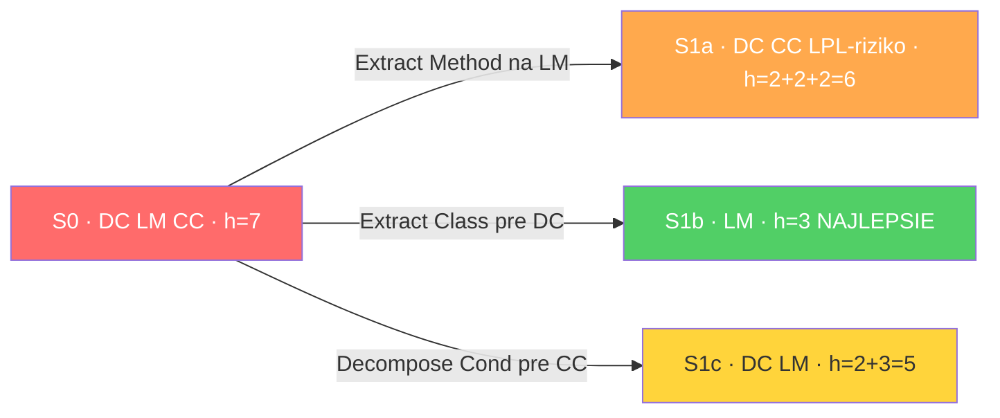

Greedy aj BFS vyberú DC ako prvý — PD=1.0 je najvyššie. Ale z rôznych dôvodov.

Greedy vidí len číslo PD=1.0 a vyberie DC. BFS simuluje a zistí, že po Extract Class na DC sa CC vyrieši ako vedľajší efekt (premenujeme `useDt` → `anchorPresent`, zmizne negácia), teda stav S1b obsahuje len `{LM}` s h=3 — oveľa lepšie ako ostatné vetvy.

Ak by DC v tomto súbore nebolo, greedy by vzal LM (najvyššia závažnosť H=3) napriek PD=−0.5. BFS by stále vzal CC ako prvý, pretože h po CC je 3 oproti h=4 po LM s LPL rizikom.

---

# AbstractExternalFilter — krok 1: Extract ParseSettings

<div class="grid grid-cols-2 gap-6">
<div>

```java {1-12|13-26}
// PRED: opaque Trinity tuple
@NotNull
protected Trinity<Pattern, Pattern, Boolean>
    getParseSettings(@NotNull String url) {
  Pattern startSection = ourClassDataStartPattern;
  Pattern endSection   = ourClassDataEndPattern;
  boolean useDt = true;          // CC: sémantika nejasná
  Matcher m = ourAnchorSuffix.matcher(url);
  if (m.find()) {
    useDt = false;               // negovaný flag
    startSection = Pattern.compile(...);
    endSection = ourNonClassDataEndPattern;
  }
  return Trinity.create(startSection, endSection, useDt);
}

// PO: pomenovaný value object
@NotNull
protected ParseSettings
    getParseSettings(@NotNull String url) {
  Pattern startSection = ourClassDataStartPattern;
  Pattern endSection   = ourClassDataEndPattern;
  boolean anchorPresent = false; // CC: jasná sémantika
  Matcher m = ourAnchorSuffix.matcher(url);
  if (m.find()) {
    anchorPresent = true;        // bez negácie
    startSection = Pattern.compile(...);
    endSection = ourNonClassDataEndPattern;
  }
  return new ParseSettings(startSection, endSection,
                           !anchorPresent, anchorPresent);
}
```

</div>
<div>

**Nová vnútorná trieda (Extract Class — reálny commit):**

```java
protected static class ParseSettings {
  @NotNull
  private final Pattern startPattern;   // pomenované!
  @NotNull
  private final Pattern endPattern;     // pomenované!
  private final boolean forcePatternSearch;
  private final boolean useDt;

  public ParseSettings(
      @NotNull Pattern startPattern,
      @NotNull Pattern endPattern,
      boolean useDt,
      boolean forcePatternSearch) {
    this.startPattern = startPattern;
    this.endPattern = endPattern;
    this.useDt = useDt;
    this.forcePatternSearch = forcePatternSearch;
  }
}
```

DC vyriešený ✅ · CC vyriešený ✅ ako vedľajší efekt

Stav: **{LM}** · $h = 3$

</div>
</div>

---

# AbstractExternalFilter — krok 2: LM je teraz triviálne

**Stav {LM}** — `doBuildFromStream()` teraz pristupuje k pomenovaným poliam namiesto `settings.first/.second`

<div class="grid grid-cols-2 gap-6">
<div>

```java
// PRED: opaque prístup v 120-riadkovej metóde
Trinity<Pattern, Pattern, Boolean> settings =
    getParseSettings(url);
Pattern startSection = settings.first;
Pattern endSection   = settings.second;
boolean useDt        = settings.third;

// ... 100+ riadkov pracujúcich s týmito premennými ...

if (matchStart && input instanceof MyReader) {
  // vždy skúša pattern — aj keď to nie je potrebné
}
```

</div>
<div>

```java
// PO: čitateľný prístup cez mená
ParseSettings settings = getParseSettings(url);
Pattern startSection = settings.startPattern;
Pattern endSection   = settings.endPattern;
boolean useDt        = settings.useDt;

// ... rovnaká logika, ale čitateľná ...

if (matchStart
    && !settings.forcePatternSearch  // NOVÉ pole
    && input instanceof MyReader) {
  // preskočí pattern search keď to nie je potrebné
}
```

Pole `forcePatternSearch` bolo možné pridať len po tom, čo DC refaktoring pomenoval koncepty. Pred tým by sme museli pridávať ďalší parameter do `Trinity` — čo by bol ďalší DC smell.

</div>
</div>

Extract Method na `doBuildFromStream()` teraz čisto oddeľuje HTML-building od pattern-matchingu. LM vyriešený ✅ · **$h = 0$**

---

# Porovnanie: AbstractExternalFilter

<div class="grid grid-cols-2 gap-8">
<div>

### Greedy — vyberie DC (PD=1.0, najvyššie)
```
S0: {DC, LM, CC}               h=7
Krok 1: Extract Class (DC) →
        {LM}                   h=3
  CC vyriešený ako vedľajší efekt
  (useDt → anchorPresent, pomenované polia)
  forcePatternSearch pole ODBLOKOVANÉ
Krok 2: Extract Method (LM) →
        {}                     h=0 ✅
────────────────────────────────────
2 kroky · 0 nových smellov ✅
Greedy súhlasí s BFS.
```

</div>
<div>

### Čo keby DC nebolo? Greedy zlyhá
```
S0: {LM, CC}                   h=5
Greedy vezme LM (H=3, PD=−0.5 ale najvyššia sev)

Krok 1: Extract Method (LM) →
  kód stále používa opaque boolean flag
  → CC zostáva, plus LPL riziko
        {CC, LPL?}             h=2+2=4
Krok 2: Decompose CC →
        {}                     h=0 ✅
────────────────────────────────────
BFS vezme CC ako prvý (h=3 < 4),
potom LM čisto — 0 LPL riziko, 2 kroky
```

Greedy súhlasil s BFS len preto, že DC malo najvyššie PD. BFS rozhoduje vždy cez simuláciu $h$ a je robustné aj keď PD dáva zlý signál — napríklad smelly s negatívnym PD, ktoré greedy zoberie ako posledné, ale BFS ich správne zaradí skôr.

Zhoduje sa so skutočným commitom developera `7a4dab88`.

</div>
</div>

---

# Prečo je to dôležité?

Greedy hodnotí každý smell izolovane v jednom momente. BFS modeluje ako **poradie mení graf závislostí**.

<div class="grid grid-cols-2 gap-8 mt-4">
<div>

**Čo vidí greedy:**
- GC má PD = 0.5 ← vezme ho (remíza rozhodnutá závažnosťou)
- LM má PD = 0.5 ← rovnako
- DC má PD = 1.0 ← najvyššie, ale GC/LM idú skôr

Greedy nevie, že refaktorovanie GC **kým LM existuje** aktivuje negatívnu závislosť GC → II. Vypočíta PD raz na začiatku a nikdy ho neaktualizuje podľa aktuálneho stavu.

</div>
<div>

**Čo vidí BFS:**
- Simuluje: refaktorujem GC teraz → h ide z 8 na 10 — zlé
- Simuluje: refaktorujem LM teraz → h ide z 8 na 5 — toto
- Po zmiznutí LM: podmienka pre GC → II nesplnená → bezpečné

BFS nachádza, že **zmazanie LM ako prvého deaktivuje negatívnu závislosť GC** — dvojkrokový lookahead, ktorý greedy nedokáže.

Oba príklady ukazujú rovnaký vzor, potvrdený skutočnými developermi.

</div>
</div>
