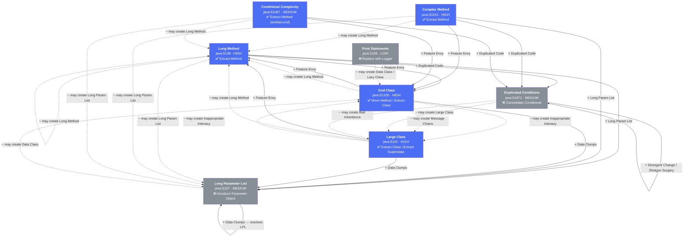
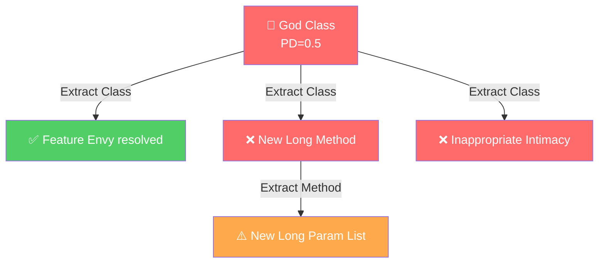
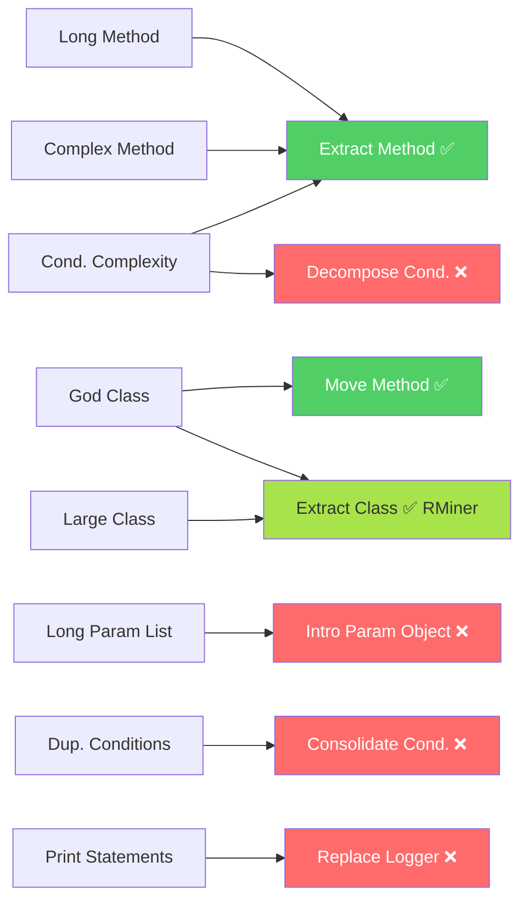
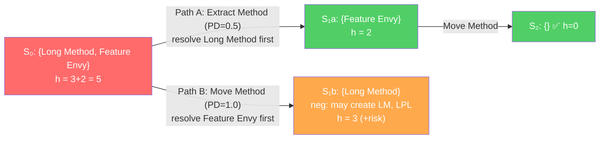
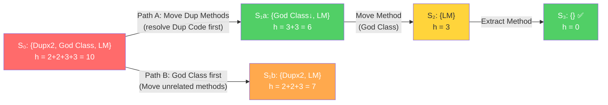
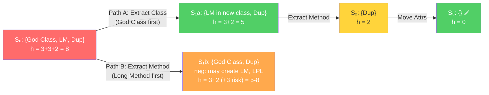
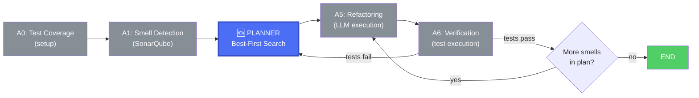
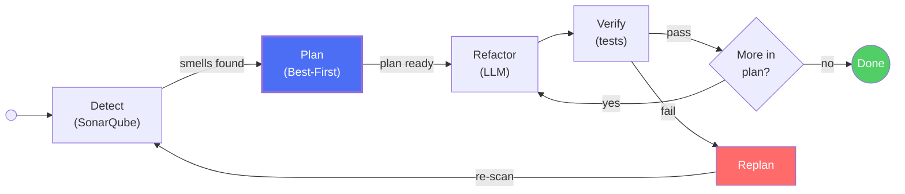
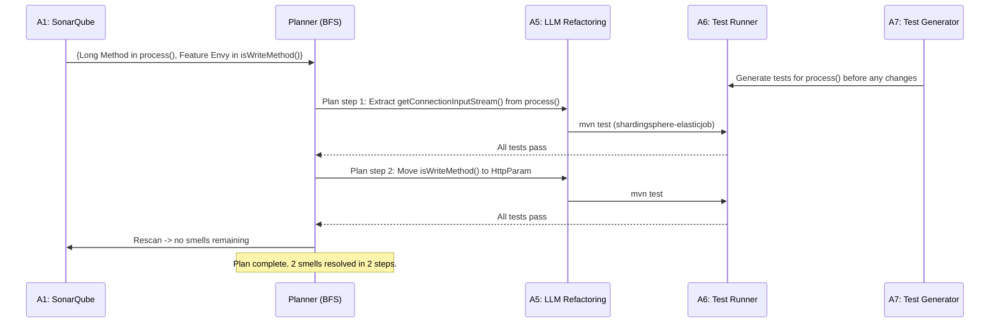

# Best-First Search Planning for Smell Refactoring

Introducing planning into the multi-agent refactoring workflow

Havriil Pietukhin

<style>
  .mermaid svg {
    max-height: 480px !important;
    width: auto !important;
  }
  .slidev-code {
    font-size: 0.82em !important;
    line-height: 1.35 !important;
  }
</style>

---

# Smell dependency graph: what we model

All 8 detected smells and their refactoring-induced dependencies (Markovič & Polášek rules).

<div class="text-xs mb-1">
<span class="inline-block px-2 py-0.5 rounded mr-2" style="background:#51cf66;color:#fff">solid arrow = positive (resolves another smell)</span>
<span class="inline-block px-2 py-0.5 rounded mr-2" style="background:#ff6b6b;color:#fff">dashed arrow = negative (may create a smell)</span>
<span class="inline-block px-2 py-0.5 rounded mr-2" style="background:#4c6ef5;color:#fff">✅ refactoring available in datasets</span>
<span class="inline-block px-2 py-0.5 rounded" style="background:#868e96;color:#fff">❌ refactoring NOT in datasets (ground truth gap)</span>
</div>



**Blue = refactoring covered by datasets · Grey = ground truth gap (not in RefactoringMiner 2.0 or SWE-Refactor)**

---

# Priority score: PD formula

Two forms of the **PD (priority)** score:

**General (abstract):**
$$PD_i = w \cdot \text{severity}(s_i) \cdot \text{freq}(s_i) + \sum\text{pos\_out}(s_i) - \sum\text{neg\_out}(s_i)$$

**Concrete (implementation):**
$$PD^{\text{conc}}_i = w \cdot \text{severity}(s_i) + \sum\text{pos\_out}^{\text{conc}}(s_i) - \sum\text{neg\_out}^{\text{abs}}(s_i)$$

- $w = 0.5$ — weight constant; severity from SonarQube (HIGH=3, MED=2, LOW=1)
- $\text{freq}$ — occurrence count (not yet in implementation, future work)
- **Concrete** positive edges: co-located smells found in the actual source
- **Abstract** negative edges: catalogue rules from Markovič & Polášek

**Greedy:** pick $\arg\max PD_i$ at each step — myopic, ignores cascading effects.

---

# Why greedy falls short


<div class="grid grid-cols-2 gap-8">
<div>

**Scenario: God Class + Long Methods**

A God Class is picked first by greedy. Refactoring it via Extract Class may:

- (+) Resolve Feature Envy, Data Clumps
- (-) **Create** new Long Methods in extracted classes
- (-) **Create** Inappropriate Intimacy

The newly created smells force additional unplanned refactorings.

</div>
<div>



</div>
</div>

---

# Proposed: Best-first search planning

Model the refactoring process as a **search problem** over the space of smell configurations.

| Component | Definition |
|-----------|-----------|
| **State** | Current set of smells S = {s₁, s₂, ..., sₙ} with severities |
| **Initial state** | S₀ = all smells detected by SonarQube |
| **Actions** | Apply refactoring r(sᵢ) to address smell sᵢ |
| **Transition** | S' = (S \ resolved(sᵢ)) ∪ created(sᵢ) |
| **Heuristic** | h(S) = Σ severity(s) - estimated_positive_impact |
| **Goal** | Minimize total remaining smell impact |

**Key advantage:** Can explore multiple paths and **backtrack** when negative dependencies make a path worse.

---

# Real dataset example: DocumentationManager (RMiner, IntelliJ)

**Source:** `intellij-community`, commit `7a4dab88` · file `DocumentationManager.java` (971 LOC, 78 methods, 7 long methods)

**SonarQube detects 4 smells** | $w=0.5$

| Smell | SQ rule | sev | pos\_out (co-located) | neg\_out (abstract) | **PD** |
|-------|---------|-----|-----------------------|---------------------|--------|
| **GC**: God Class | S1200 | H=3 | **2** → FE (LM₁ `showInPopup`), FE (LM₂ `doFetchDocInfo`) | 2 → LM', II | 0.5·3+**2**−2 = **1.5** ← highest |
| **LM₁**: Long Method `showInPopup` (99 LOC) | S138 | H=3 | 1 → FE (GC) | 2 → LM', LPL | 0.5·3+1−2 = **0.5** |
| **LM₂**: Long Method `doFetchDocInfo` (93 LOC) | S138 | H=3 | 1 → FE (GC) | 2 → LM', LPL | 0.5·3+1−2 = **0.5** |
| **DC**: Dup Conditions (`showJavaDocInfo` overloads) | S1871 | M=2 | 0 | 1 → LC | 0.5·2+0−1 = **0** |

$h(S_0) = 3+3+3+2 = \mathbf{11}$

**Greedy always picks GC** — PD=1.5 strictly highest. No tie. No escape.

---

# DocumentationManager — Why GC has the highest PD

GC scores highest because it has **2 positive out-edges** — it co-locates with *both* long methods:

```
GC ──(+FE)──► LM₁ (showInPopup, 99 LOC)   ← display responsibility
GC ──(+FE)──► LM₂ (doFetchDocInfo, 93 LOC) ← fetch responsibility
GC ──(−)────► LM'  (neg: may create new Long Method in extracted class)
GC ──(−)────► II   (neg: extracted class calls DocumentationManager fields)
```

Each positive edge means: refactoring GC *could* resolve that Feature Envy as a side effect.
PD rewards this: `PD(GC) = 0.5·3 + 2 − 2 = 1.5`

But both LM₁ and LM₂ still exist → **both neg-deps fire** when Extract Class runs.
Greedy cannot see this. It only sees the score in the current state.

---

# DocumentationManager — Step 1: Greedy picks GC (PD=1.5)

**Action:** Extract Class on `DocumentationManager` → split into display + fetch classes

- ✅ Pos dep: Feature Envy from LM₁ and LM₂ partially resolved
- ❌ **Neg dep fires → LM'**: extracted display class inherits `showInPopup` (99 LOC) verbatim
- ❌ **Neg dep fires → II**: extracted class still calls `myComponent`, `myEditor`, `myProject` from parent

**New state $S_1^G$ = {LM₁, LM₂, DC, NEW: LM', NEW: II}**

| Smell | Severity |
|-------|----------|
| LM₁: `showInPopup` | H=3 |
| LM₂: `doFetchDocInfo` | H=3 |
| DC: Dup Conditions | M=2 |
| **LM'**: new Long Method in extracted class | H=3 |
| **II**: Inappropriate Intimacy | M=2 |

$h(S_1^G) = 3+3+2+3+2 = \mathbf{13}$ ↑ **worse than start (was 11)!**

---

# DocumentationManager — Step 1: BFS avoids the trap

**BFS simulates all 4 first actions:**

| First action | Resulting state | $h$ |
|---|---|---|
| Extract Class (GC) | {LM₁, LM₂, DC, LM', II} | **13** ↑ worst |
| Extract Method (LM₁) | {GC, LM₂, DC} | **8** |
| Extract Method (LM₂) | {GC, LM₁, DC} | **8** |
| Fix Dup Conditions (DC) | {GC, LM₁, LM₂} | **9** |

**BFS picks LM₁ or LM₂** (h=8) — either Extract Method first.

**Action:** Extract Method on `showInPopup` *(split popup construction from callback logic)*

- ✅ Pos dep: FE toward GC partially resolved — GC now has only 1 co-located LM left
- ❌ Neg dep LM→LPL: does not fire (extraction is clean)

**New state $S_1^B$ = {GC, LM₂, DC}**, $h = 3+3+2 = \mathbf{8}$

---

# DocumentationManager — BFS Steps 2–4: reaching goal

**$S_1^B$ = {GC, LM₂, DC}** — recalculate PD:

| Smell | pos\_out | neg\_out | PD |
|-------|----------|----------|----|
| GC | 1 (FE→LM₂ still) | 2 (→LM',II) | 0.5·3+1−2 = **0.5** |
| LM₂ | 1 (FE→GC) | 2 | 0.5·3+1−2 = **0.5** |
| DC | 0 | 1 | 0.5·2+0−1 = **0** |

**BFS picks LM₂** (same h=5 as GC branch, but LM₂ first removes GC's neg-dep precondition):

Step 2: Extract Method on `doFetchDocInfo` → $S_2^B$ = {GC, DC}, $h=5$

Step 3: Extract Class on GC — **neg-deps don't fire** (both LMs gone) → $S_3^B$ = {DC}, $h=2$

Step 4: Fix Dup Conditions → $S_4^B$ = {}, $h=0$ ✅

---

# DocumentationManager — Greedy vs BFS summary

**Real commit `7a4dab88`, IntelliJ `DocumentationManager.java`** | $w=0.5$

<div class="grid grid-cols-2 gap-4">
<div>

### Greedy (always picks GC, PD=1.5)
```
S₀: {GC,LM₁,LM₂,DC}           h=11
Step 1: GC  → {LM₁,LM₂,DC,LM',II} h=13 ↑
Step 2: LM₁ → {LM₂,DC,LM',II}     h=10
Step 3: LM₂ → {DC,LM',II}          h=7
Step 4: LM' → {DC,II}              h=4
Step 5: DC  → {II}                 h=2
Step 6: II  → {}                   h=0 ✅
─────────────────────────────
6 steps | 2 new smells (LM', II)
```

</div>
<div>

### BFS (LM₁ → LM₂ → GC → DC)
```
S₀: {GC,LM₁,LM₂,DC}     h=11
Step 1: LM₁ → {GC,LM₂,DC} h=8
Step 2: LM₂ → {GC,DC}     h=5
Step 3: GC  → {DC}         h=2  (0 neg-deps!)
Step 4: DC  → {}           h=0 ✅
─────────────────────────────
4 steps | 0 new smells
```

</div>
</div>

**GC's PD=1.5 is strictly the highest** — greedy has no choice but to pick it first, every time. BFS discovers that clearing both Long Methods first removes the structural preconditions for GC's negative dependencies.

---

# The PD heuristic function

Two forms used in planning (`prioritize_smells.py`):

**General:** $PD_i = w \cdot \text{sev}(s_i) \cdot \text{freq}(s_i) + \sum\text{pos\_out}(s_i) - \sum\text{neg\_out}(s_i)$

**Concrete (impl):** $PD^{\text{conc}}_i = w \cdot \text{sev}(s_i) + \sum\text{pos\_out}^{\text{conc}}(s_i) - \sum\text{neg\_out}^{\text{abs}}(s_i)$

- $w = 0.5$; severity: HIGH=3, MED=2, LOW=1
- **Concrete pos edges**: smells co-located in the actual source file
- **Abstract neg edges**: Markovič & Polášek catalogue rules
- Positive deps may not materialise in all cases — empirical probability weighting is future work
- Negative deps are treated as more reliable (structural risk)

**State heuristic:** $h(S) = \sum_{s \in S} \text{sev}(s)$ — total remaining severity

**Greedy:** $\arg\max PD_i$ (depth-1) | **BFS:** expands lowest $h(S)$

---

# What smells do we detect?

Our SonarQube integration detects **8 smell types**:

| Smell Type | SonarQube Rule | Severity | Typical Refactoring |
|-----------|---------------|----------|-------------------|
| Long Method | java:S138 | HIGH | **Extract Method** |
| Complex Method | java:S1541 | HIGH | **Extract Method** / Decompose Conditional |
| Conditional Complexity | java:S1067 | MEDIUM | Replace Conditional / **Extract Method** |
| Long Parameter List | java:S107 | MEDIUM | Introduce Parameter Object |
| God Class | java:S1200 | HIGH | Extract Class / **Move Method** |
| Large Class | java:S110 | HIGH | Extract Class |
| Duplicated Conditions | java:S1871 | MEDIUM | Consolidate Conditional |
| Print Statements | java:S106 | LOW | Replace with Logger |

Bold = available in our datasets.

---

# What refactorings do the datasets have?

<div class="grid grid-cols-2 gap-4">
<div>

### RMiner oracle (549 commits, 188 repos)
15,562 refactorings (11,514 TP), **101 unique types**.

| Refactoring | Total | TP |
|------------|------:|---:|
| Rename Method | 1,161 | 400 |
| **Move Class** | 1,115 | 855 |
| **Extract Method** | 1,096 | 1,033 |
| **Move Method** | 1,067 | 266 |
| Change Variable Type | 910 | 811 |
| **Extract Variable** | 325 | 325 |
| **Extract And Move Method** | 295 | 127 |
| **Inline Method** | 149 | 120 |
| **Extract Class** | 108 | 108 |
| **Extract Superclass** | 80 | 72 |
| + 91 more types | ... | ... |

</div>
<div>

### SWE-Refactor dataset (1,099 records, 18 projects)
| Refactoring | Count |
|------------|------:|
| **Extract Method** | 441 |
| **Move Method** | 410 |
| Extract And Move Method | 142 |
| **Inline Method** | 71 |
| Move And Rename Method | 21 |
| Move And Inline Method | 14 |

Top projects: Guava (300), PMD (125), JUnit5 (105), Commons-IO (93), Checkstyle (91), Hibernate (63+89).

</div>
</div>

---

# Gap analysis: smells vs available refactorings




---

# Coverage summary

<div class="grid grid-cols-2 gap-8">
<div>

### Covered (green path)
- **Long Method** -> Extract Method (SWE-Refactor: 441, RMiner: 1,033 TP)
- **Complex Method** -> Extract Method (same datasets)
- **God Class** -> Move Method (SWE-Refactor: 410) + Extract Class (RMiner: 108 TP)
- **Large Class** -> Extract Class (RMiner: 108 TP) + Extract Superclass (72 TP)
- **Conditional Complexity** -> Extract Method (workaround)

Both datasets together cover most method-level and some class-level refactorings.

</div>
<div>

### NOT covered (red path)
- **Long Parameter List** -> Introduce Parameter Object (missing from both datasets)
- **Duplicated Conditions** -> Consolidate Conditional (missing)
- **Print Statements** -> Replace with Logger (missing, low priority)

Note: Extract Class is now covered by the full RMiner oracle (108 TP instances), significantly closing the gap for God Class / Large Class.

</div>
</div>

**Conclusion:** SWE-Refactor covers method-level refactorings. The full RMiner oracle adds **Extract Class (108 TP)**, **Extract Superclass (72 TP)**, and **91 more types**. Together they cover **6 of 8** smell types.

---

# Real Example 1: HttpJobExecutor (SWE-Refactor)

<style scoped>
pre { font-size: 0.72em; line-height: 1.4; }
</style>

From **shardingsphere-elasticjob** project, commit `1bdc817c`. Two refactorings on the same file.

<div class="grid grid-cols-2 gap-4">
<div>

**Smells in `HttpJobExecutor.process()`:**
- **Long Method** (java:S138) — 40+ lines, HTTP setup + request + response parsing all inline
- **Feature Envy** — `isWriteMethod(method)` takes a String param from `HttpParam` and checks it; belongs in `HttpParam` itself

**Two refactorings applied in this commit:**
1. Extract Method: `getConnectionInputStream()` from `process()`
2. Move Method: `isWriteMethod()` from HttpJobExecutor to HttpParam

</div>
<div>

```java
// BEFORE: process() — everything inline
public void process(ElasticJob elasticJob,
    JobConfiguration jobConfig, ...) {
  HttpParam httpParam = getHttpParam(jobConfig.getProps());
  HttpURLConnection connection = null;
  try {
    URL url = new URL(httpParam.getUrl());
    connection = (HttpURLConnection) url.openConnection();
    connection.setRequestMethod(httpParam.getMethod());
    connection.setDoOutput(true);
    connection.setConnectTimeout(httpParam.getConnectTimeout());
    connection.setReadTimeout(httpParam.getReadTimeout());
    // ... setup headers, connect
    if (isWriteMethod(httpParam.getMethod())  // Feature Envy
        && !Strings.isNullOrEmpty(data)) {
      // write data ...
    }
    int code = connection.getResponseCode();
    InputStream resultInputStream;
    if (isRequestSucceed(code)) {           // inline
      resultInputStream = connection.getInputStream();
    } else {
      log.warn("HTTP job {} response {}", ...);
      resultInputStream = connection.getErrorStream();
    }
    // ... read response, log result
  } catch (IOException ex) { throw ...; }
}
private boolean isWriteMethod(String method) {
  return Arrays.asList("POST","PUT","DELETE")
    .contains(method.toUpperCase());
}
```

</div>
</div>

---

# HttpJobExecutor: Best-First Search Plan

**PD calculation** (`PD = w·sev + Σpos_out_conc − Σneg_out_abs`):
- Long Method (H=3): pos_out=1 (FE), neg_out=2 (LM,LPL) → PD = 0.5·3+1−2 = **0.5**
- Feature Envy (M=2): pos_out=0, neg_out=0 → PD = 0.5·2+0−0 = **1.0**



**Greedy and search agree:** Long Method (highest PD) first. Moving `isWriteMethod()` first (Path B) would bring the long method's complexity into HttpParam, and `Long Method -> {Long Method, Long Param List}` negative deps apply.

---

# HttpJobExecutor: Code Evolution

<style scoped>
pre { font-size: 0.62em; line-height: 1.3; }
h3 { margin-bottom: 0.2em; }
</style>

<div class="grid grid-cols-3 gap-3">
<div>

### Original (2 smells)
```java
public void process(...) {
  HttpParam hp = getHttpParam(...);
  connection = (HttpURLConnection)
    new URL(hp.getUrl()).openConnection();
  connection.setRequestMethod(hp.getMethod());
  connection.setDoOutput(true);
  // ... setup headers, connect
  if (isWriteMethod(hp.getMethod()) // [FE]
      && !Strings.isNullOrEmpty(data)) {
    // write data ...
  }
  int code = connection.getResponseCode();
  InputStream is;
  if (isRequestSucceed(code)) {     // [LM]
    is = connection.getInputStream();
  } else {
    log.warn("HTTP {} resp {}", ...);
    is = connection.getErrorStream();
  }
  // ... read response, log result
}
private boolean isWriteMethod(String m) {
  return Arrays.asList("POST","PUT","DELETE")
    .contains(m.toUpperCase());
}
```

</div>
<div>

### Step 1: Extract Method
```java
public void process(...) {
  HttpParam hp = getHttpParam(...);
  connection = (HttpURLConnection)
    new URL(hp.getUrl()).openConnection();
  connection.setRequestMethod(hp.getMethod());
  connection.setDoOutput(true);
  // ... setup headers, connect
  if (isWriteMethod(hp.getMethod()) // [FE]
      && !Strings.isNullOrEmpty(data)) {
    // write data ...
  }
  int code = connection.getResponseCode();
  InputStream is =
    getConnectionInputStream(        // NEW
      jobConfig.getJobName(),
      connection, code);
  // ... read response, log result
}
// EXTRACTED:
private InputStream
    getConnectionInputStream(
    String name, HttpURLConnection c,
    int code) throws IOException {
  if (isRequestSucceed(code))
    return c.getInputStream();
  log.warn("HTTP {} resp {}", name, code);
  return c.getErrorStream();
}
```
LM resolved. FE remains.

</div>
<div>

### Step 2: Move Method
```java
// HttpJobExecutor:
public void process(...) {
  HttpParam hp = getHttpParam(...);
  connection = (HttpURLConnection)
    new URL(hp.getUrl()).openConnection();
  connection.setRequestMethod(hp.getMethod());
  connection.setDoOutput(true);
  // ... setup headers, connect
  if (hp.isWriteMethod()            // MOVED
      && !Strings.isNullOrEmpty(data)) {
    // write data ...
  }
  int code = connection.getResponseCode();
  InputStream is =
    getConnectionInputStream(
      jobConfig.getJobName(),
      connection, code);
  // ... read response, log result
}

// HttpParam (target class):
public boolean isWriteMethod() {
  return Arrays.asList("POST","PUT","DELETE")
    .contains(method.toUpperCase());
  // uses own field, no param needed
}
```
FE resolved. **0 smells remain.**

</div>
</div>

---

# Real Example 2: checkstyle UnusedLocalVariableCheck (SWE-Refactor)

<style scoped>
pre { font-size: 0.68em; line-height: 1.35; }
</style>

From **checkstyle** project, commit `1ca66693`. **5 refactorings** across 2 files -- Duplicated Code + God Class.

<div class="grid grid-cols-2 gap-4">
<div>

**Smells detected:**
- **Duplicated Code** — `extractQualifiedName()` is copy-pasted in both `UnusedLocalVariableCheck` and `FinalClassCheck` (source comments say "Duplicated, until issue #11201")
- **God Class** — `UnusedLocalVariableCheck` contains utility methods (`getShortNameOfAnonInnerClass`, `getQualifiedTypeDeclarationName`) unrelated to its core responsibility
- **Long Method** — `getTheNearestClass()` has inline lambda logic

**5 refactorings applied in this commit:**
1. Move Method: `extractQualifiedName()` from UnusedLocalVariableCheck
2. Move Method: `extractQualifiedName()` from FinalClassCheck
3. Move Method: `getQualifiedTypeDeclarationName()` from UnusedLocalVariableCheck
4. Move Method: `getShortNameOfAnonInnerClass()` from UnusedLocalVariableCheck
5. Extract Method: `getTypeDeclarationNameMatchingCountDiff()` from `getTheNearestClass()`

</div>
<div>

**The duplicated method (real source code):**
```java
// In UnusedLocalVariableCheck.java:
/**
 * ...
 * Duplicated, until
 * <a>https://github.com/checkstyle/checkstyle/issues/11201</a>
 */
private static String extractQualifiedName(DetailAST ast) {
  return FullIdent.createFullIdent(ast).getText();
}

// In FinalClassCheck.java — IDENTICAL:
private static String extractQualifiedName(DetailAST ast) {
  return FullIdent.createFullIdent(ast).getText();
}
```

**Also duplicated:**
```java
// In UnusedLocalVariableCheck.java:
/**
 * Duplicated, until issue #11201
 */
private static String getQualifiedTypeDeclarationName(
    String packageName,
    String outerClassQualifiedName,
    String className) {
  // ... 15 lines of qualified name construction
}
```

</div>
</div>

---

# checkstyle: Best-First Search Plan with PD

**Initial state S0:** {Dup Codex2 (M=2 each), God Class (H=3), Long Method (H=3)}

**PD calculation** (`PD = w·sev + Σpos_out_conc − Σneg_out_abs`):

| Candidate smell | Severity | pos_out (conc) | neg_out (abs) | **PD** |
|--------|----------|---------|------|
| **Dup Code** (x2) | 2 | 0 (not co-located) | 1 (→LC) | 0.5·2+0−1 = **0** |
| **God Class** | 3 | 1 (FE co-located) | 2 (→LM,II) | 0.5·3+1−2 = **0.5** |
| **Long Method** | 3 | 1 (Dup Code) | 2 (→LM,LPL) | 0.5·3+1−2 = **0.5** |

**Greedy picks** God Class or Long Method (PD=0.5, tied). But search explores both orderings:



**Search picks Path A** (h=6 < h=7) — resolving Dup Code first lowers total severity faster despite lower PD.

---

# Real Example 3: languagetool UkrainianTagger (RMiner oracle)

<style scoped>
pre { font-size: 0.72em; line-height: 1.4; }
</style>

From **languagetool** project, commit `bec15926de`. **9 TP refactorings** -- God Class decomposition.

<div class="grid grid-cols-2 gap-4">
<div>

**Smells in `UkrainianTagger`:**
- **God Class** (java:S1200) — tagger does compound tagging, pos-tag helpers, attribute storage, regex patterns
- **Long Method** (java:S138) — `guessCompoundTag()` has complex word analysis logic
- **Duplicated Code** — regex patterns and maps shared across concerns

**9 refactorings applied (all TP in oracle):**
1. **Extract Class**: `CompoundTagger` from `UkrainianTagger`
2. **Extract Method**: `doGuessCompoundTag()` from `guessCompoundTag()` in CompoundTagger
3. **Move Attribute**: `VIDMINKY_MAP` -> `PosTagHelper`
4. **Extract Attribute**: `NUM_REGEX` in `PosTagHelper`
5. **Extract Attribute**: `CONJ_REGEX` in `PosTagHelper`
6. **Extract Variable**: `leftConj` in CompoundTagger
7. Change Method Access Modifier
8. Change Attribute Access Modifier
9. Rename Method

</div>
<div>

**PD calculation** (`PD = w·sev + Σpos_out_conc − Σneg_out_abs`):

| Candidate | Severity | pos_out (conc) | neg_out (abs) | **PD** |
|--------|----------|---------|------|
| **God Class** | 3 | 1 (FE,DC) | 2 (→LM,II) | 0.5·3+1−2 = **0.5** |
| **Long Method** | 3 | 1 (Dup Code) | 2 (→LM,LPL) | 0.5·3+1−2 = **0.5** |
| **Dup Code** | 2 | 0 | 0 | 0.5·2+0−0 = **1.0** |

**Tied at PD=0.5.** Search explores both first steps:



**Search picks Path A** — Extract Class has no negative deps, while Extract Method risks creating new Long Method/Long Param List (per `DEPENDENCY_RULES`).

</div>
</div>

---

# Dependency rules powering the search

The search uses **Markovič & Polášek dependency rules** as its transition model.

<div class="grid grid-cols-2 gap-4 text-sm">
<div>

### Positive dependencies (resolves)
| Refactoring target | May also resolve |
|---|---|
| Long Method | Switch Statement, Feature Envy, Duplicated Code, Divergent Change, Comments, Long Param List |
| Complex Method | (same as Long Method) |
| Conditional Complexity | (same as Long Method) |
| Long Param List | Long Param List, Data Clumps |
| Large Class / God Class | Data Clumps, Feature Envy, Bad Class Content |
| Duplicated Conditions | Divergent Change, Shotgun Surgery |

</div>
<div>

### Negative dependencies (creates)
| Refactoring target | May create |
|---|---|
| Long Method | Long Method, Long Param List |
| Complex Method | Long Method, Long Param List |
| Long Param List | Data Class |
| Large Class / God Class | Long Method, Data Class, Inappropriate Intimacy, Message Chains |
| Duplicated Conditions | Large Class, Bad Inheritance |

</div>
</div>

---

# Integration into the agentic workflow




**The planner replaces the greedy algorithm** in Agent 4 (Smell Prioritization).

Key change: Instead of a single priority queue, the planner produces an **ordered plan** — a sequence of (smell, refactoring) pairs — optimized for minimal total negative impact.

---

# Planner: replanning on failure


When verification fails, the planner **replans** from the current state.



**Replan triggers:**
1. Test failure after refactoring (rollback + rescan + replan)
2. New smells detected that weren't predicted by dependency rules
3. Predicted positive dependencies didn't materialize

---

# What we CAN evaluate today

Given current dataset coverage, the planner can be evaluated for these smell combinations:

| Scenario | Smells Involved | Refactoring | Dataset |
|----------|----------------|-------------|---------|
| Long Method cluster | Long Method + Complex Method + Cond. Complexity | Extract Method chain | SWE-Refactor (441) |
| God Class decomposition | God Class + Feature Envy | Move Method series | SWE-Refactor (410) |
| Class-level decomposition | God Class + Large Class | Extract Class | RMiner oracle (108 TP) |
| Method extraction cascade | Long Method resolves Dup Code | Extract Method | RMiner (1,033 TP) + SWE-Refactor |
| Compound refactoring | Long Method + Feature Envy | Extract And Move Method | SWE-Refactor (142) + RMiner (127 TP) |
| Inline dead code | Middle Man / unnecessary delegation | Inline Method | SWE-Refactor (71) + RMiner (120 TP) |
| Inheritance refactoring | Large Class with shared behavior | Extract Superclass | RMiner oracle (72 TP) |

These cover **6 of 8** detected smell types with ground truth.

---

# What we CANNOT evaluate today

| Missing Refactoring | Needed For | Impact |
|---------------------|-----------|--------|
| **Introduce Parameter Object** | Long Parameter List | No ground truth for parameter grouping |
| **Consolidate Conditional** | Duplicated Conditions | No ground truth for condition merging |
| **Decompose Conditional** | Conditional Complexity | Must use Extract Method as workaround |
| **Replace with Logger** | Print Statements | Trivial refactoring, low priority |

**Previously missing, now covered by RMiner oracle:**
- Extract Class (108 TP) — for God Class / Large Class decomposition
- Extract Superclass (80 total, 72 TP) — for inheritance-based decomposition
- Merge Parameter (28 TP) — partial coverage for Long Parameter List

---

# Proposed evaluation strategy

<div class="grid grid-cols-2 gap-8">
<div>

### Phase 1: Method-level planning
*Using existing datasets*

- Evaluate best-first vs greedy on **Long Method / Complex Method / Conditional Complexity** clusters
- Use SWE-Refactor Extract Method ground truth
- Measure: steps needed, new smells created, compile+test success rate

</div>
<div>

### Phase 2: Class-level planning
*Using RMiner oracle (108 Extract Class, 72 Extract Superclass TP)*

- Evaluate best-first vs greedy on **God Class / Large Class** scenarios
- Use RMiner oracle Extract Class ground truth
- Remaining gaps (Introduce Parameter Object, Consolidate Conditional): evaluate via SonarQube rescan

</div>
</div>

**Metrics for planning quality:**
- Plan efficiency: steps executed / smells resolved
- Negative dependency rate: new smells created / refactorings applied
- Backtrack rate: replans triggered / total executions

---

# End-to-end walkthrough: HttpJobExecutor




---

# Real scenario: IntelliJ AbstractExternalFilter (RMiner)

<style scoped>
pre { font-size: 0.75em; line-height: 1.4; }
</style>

Commit `7a4dab88` applies **7 refactoring types** across 4 files. The agent must decide what to fix first.

<div class="grid grid-cols-2 gap-4">
<div>

**Smells detected in `AbstractExternalFilter.java`:**

| Smell | Location | Severity |
|-------|----------|----------|
| Long Method | `doBuildFromStream()` ~120 lines | HIGH |
| Complex Method | nested loops + conditionals in same method | HIGH |
| Data Clumps | `Trinity<Pattern, Pattern, Boolean>` used as return/param everywhere | MEDIUM |

**Multiple valid refactoring paths:**

- **Path A:** Extract Method on `doBuildFromStream()` first (reduces Long Method + Complex Method)
- **Path B:** Extract Class `ParseSettings` from `Trinity` first (resolves Data Clumps across hierarchy)
- **Path C:** Inline Method + Change Return Type first (type cleanup before structural changes)

</div>
<div>

**What the developers actually did (ground truth):**

```java
// BEFORE: opaque tuple
protected Trinity<Pattern, Pattern, Boolean>
    getParseSettings(@NotNull String url) {
  return Trinity.create(defined_pattern,
    defined_pattern2, false);
}
// Callers use settings.first, settings.second, settings.third

// AFTER: named class extracted
protected ParseSettings
    getParseSettings(@NotNull String url) {
  return new ParseSettings(defined_pattern,
    defined_pattern2, false);
}
// Callers use settings.startPattern, settings.endPattern

// New class (Extract Class):
static class ParseSettings {
  final Pattern startPattern;
  final Pattern endPattern;
  final boolean useDt;
  ParseSettings(Pattern start, Pattern end,
                boolean useDt) { ... }
}
```

Developers chose **Path B** — fixing Data Clumps first improved readability before tackling the Long Method.

</div>
</div>

---

# Real scenario: IntelliJ Debugger (RMiner)

<style scoped>
pre { font-size: 0.75em; line-height: 1.4; }
</style>

Commit `76552001` refactors **9 files** in the debugger subsystem. Agent faces a cross-file choice.

<div class="grid grid-cols-2 gap-4">
<div>

**Smells spanning multiple files:**

| Smell | Files Affected | Severity |
|-------|---------------|----------|
| Long Parameter List | `DebuggerSession`, `BreakpointManager`, `DebugProcessImpl` | HIGH |
| Primitive Obsession | same 3 files — `(Document, int)` instead of `XSourcePosition` | MEDIUM |
| Extract Method needed | `RemappedSourcePosition.getLine()`, `.getOffset()` | MEDIUM |

**PD calculation** (`PD = w·sev + Σpos_out_conc − Σneg_out_abs`):

| Candidate | Severity | pos_out (conc) | neg_out (abs) | **PD** |
|--------|----------|---------|------|
| **Long Param List** (x3) | 2 | 2 (LPL,DC) | 1 (→DataClass) | 0.5·2+2−1 = **2.0** |
| **Primitive Obsession** | 2 | 0 | 0 | 0.5·2+0−0 = **1.0** |
| **Extract Method needed** | 2 | 0 | 0 | 0.5·2+0−0 = **1.0** |

</div>
<div>

**Two valid paths:**

- **Path A:** Merge Parameter `(Document, int)` -> `XSourcePosition` across all callers first (PD=2.0), then extract methods
- **Path B:** Extract Method `checkRemap()` first (PD=1.0), then fix parameter lists

```
Path A first step -> S₁: {Prim. Obs., EM needed}
  h = 2 + 2 = 4
Path B first step -> S₁: {LPLx3, Prim. Obs.}
  h = 2+2+2+2 = 8
```

**Search picks Path A** (h=4 < h=8). Long Param List's high PD=2.0 from cross-file positive deps makes it the clear first choice.

Developers agreed — parameter cleanup touched the public API and cascaded to all callers.

</div>
</div>

---

# How the planner calculates the best first step


Concrete PD calculation for the **IntelliJ AbstractExternalFilter** scenario.

**Initial state S0:** {Long Method (H=3), Complex Method (H=3), Data Clumps (M=2)}

$$PD^{\text{conc}}_i = w \cdot \text{sev}(s_i) + \sum\text{pos\_out}^{\text{conc}}(s_i) - \sum\text{neg\_out}^{\text{abs}}(s_i)$$

Positive deps from `DEPENDENCY_RULES`: Long Method -> {Feature Envy, Dup Code, Comments, ...}, God Class -> {Data Clumps, Feature Envy, ...}

| Smell | Severity | pos_out (conc) | neg_out (abs) | **PD** |
|--------|----------|---------|------|------|------|
| **Long Method** | 3 | 1 | 2 | 0.5·3+1−2 = **0.5** |
| **Complex Method** | 3 | 1 | 2 | 0.5·3+1−2 = **0.5** |
| **Data Clumps** | 2 | 0 | 0 | 0.5·2+0−0 = **1.0** |

**Greedy picks:** Long Method or Complex Method (PD=0.5, tied). Both resolve method-level smells.

But developers chose Extract Class (Data Clumps, PD=1.0) first. Why? The `Trinity` type appeared across the **entire class hierarchy** (4 files). The greedy PD score doesn't account for cross-file scope — a potential heuristic improvement:

$$PD'_i = PD_i + \delta \cdot \text{files\_affected}(s_i)$$

---

# SWE-Refactor: compound refactoring choices

<style scoped>
pre { font-size: 0.75em; line-height: 1.4; }
</style>

SWE-Refactor contains **3 compound types** where the agent must decompose a multi-step refactoring.

<div class="grid grid-cols-2 gap-4">
<div>

**Extract And Move Method** — two operations in one:

The agent detects Long Method + Feature Envy in the same method. Two valid orderings:

| Order | Step 1 | Step 2 |
|-------|--------|--------|
| A | Extract Method (reduce length) | Move Method (fix envy) |
| B | Move Method (fix envy first) | Extract in target class |

**PD calculation** (initial state, $w=0.5$):
- Long Method (H=3): pos_out=1 (FE), neg_out=2 → PD = 0.5·3+1−2 = **0.5**
- Feature Envy (M=2): pos_out=0, neg_out=0 → PD = 0.5·2+0−0 = **1.0**

Note: Feature Envy has PD=1.0 > Long Method PD=0.5 — but Long Method's Extract Method also resolves FE via positive cascade, so greedy picks it for the combined benefit → **Order A**. After extraction, the shorter method no longer exhibits Feature Envy.

</div>
<div>

**Move And Inline Method** — opposing forces:

The agent detects Feature Envy + Middle Man (unnecessary delegation). Two orderings:

| Order | Step 1 | Step 2 | Risk |
|-------|--------|--------|------|
| A | Move Method | Inline Method | Safe: move first, then simplify |
| B | Inline Method | Move (now larger) | Risky: inlining may create Long Method |

**PD calculation** ($w=0.5$):
- Feature Envy (M=2): pos_out=0, neg_out=0 → PD = 0.5·2+0−0 = **1.0**
- Middle Man (M=2): pos_out=0, neg_out=0 → PD = 0.5·2+0−0 = **1.0**

Equal PD — greedy doesn't differentiate. But search explores both:
- Path A after Move: `{Middle Man}` -> severity sum = 2
- Path B after Inline: `{Feature Envy}` + risk of new Long Method (H=3) -> severity sum up to 5

**Search picks Order A** — lower remaining severity.

</div>
</div>
