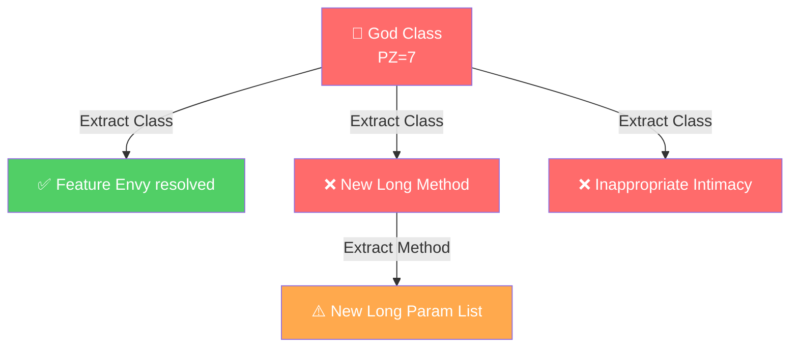
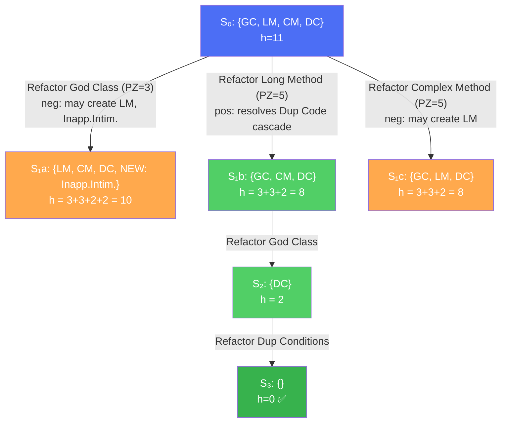
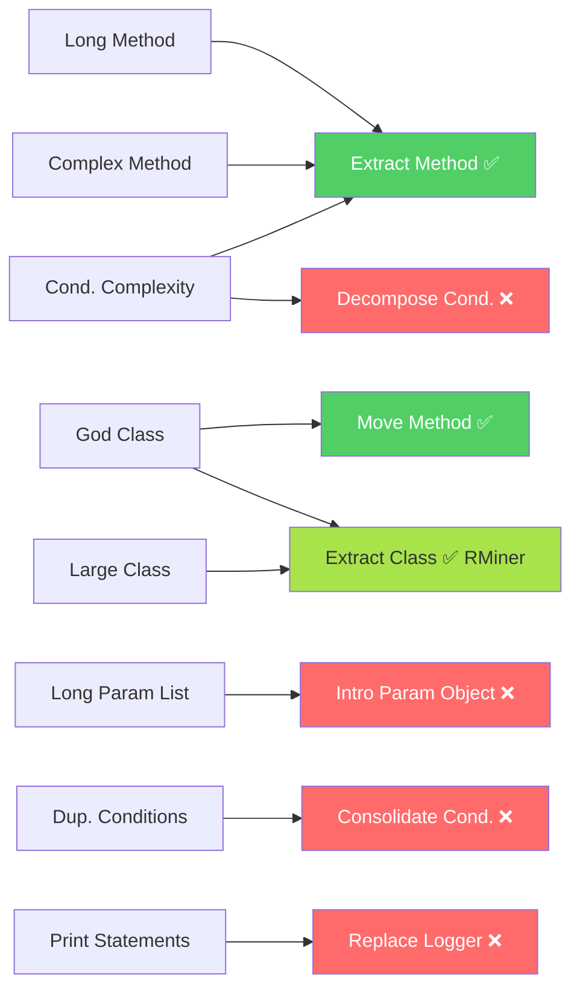
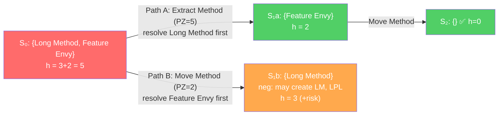
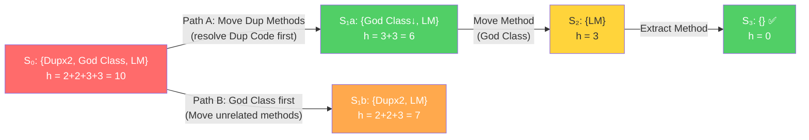
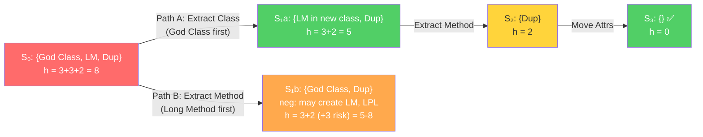
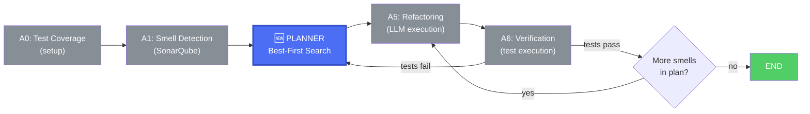
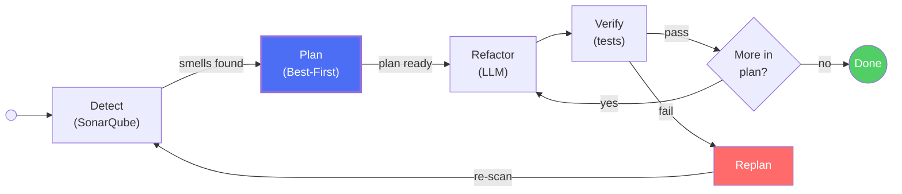
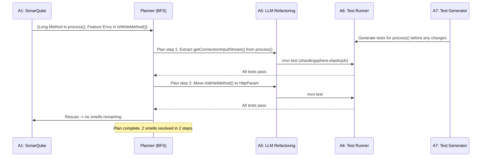

# Best-First Search Planning for Smell Refactoring

Introducing planning into the multi-agent refactoring workflow

Havriil Pietukhin

<style>
  .mermaid svg {
    max-height: 480px !important;
    width: auto !important;
  }
  .slidev-code {
    font-size: 0.82em !important;
    line-height: 1.35 !important;
  }
</style>

---

# Current approach: Greedy prioritization

The system currently uses a **greedy algorithm** to select the next smell to refactor.

$$PZ_i = \text{severity}(s_i) + |\text{positive\_out\_edges}(s_i)| \times 2$$

**Algorithm:**
1. Compute PZ for all detected smells
2. Pick the smell with **maximum PZ**
3. Refactor it
4. Remove from graph, recalculate
5. Repeat

**Problem:** Greedy is **myopic** - it commits to each choice without foreseeing cascading effects.

---

# Why greedy falls short


<div class="grid grid-cols-2 gap-8">
<div>

**Scenario: God Class + Long Methods**

A God Class (PZ=7) is picked first. Refactoring it via Extract Class may:

- (+) Resolve Feature Envy, Data Clumps
- (-) **Create** new Long Methods in extracted classes
- (-) **Create** Inappropriate Intimacy

The newly created smells force additional unplanned refactorings.

</div>
<div>



</div>
</div>

---

# Proposed: Best-first search planning

Model the refactoring process as a **search problem** over the space of smell configurations.

| Component | Definition |
|-----------|-----------|
| **State** | Current set of smells S = {s₁, s₂, ..., sₙ} with severities |
| **Initial state** | S₀ = all smells detected by SonarQube |
| **Actions** | Apply refactoring r(sᵢ) to address smell sᵢ |
| **Transition** | S' = (S \ resolved(sᵢ)) ∪ created(sᵢ) |
| **Heuristic** | h(S) = Σ severity(s) - estimated_positive_impact |
| **Goal** | Minimize total remaining smell impact |

**Key advantage:** Can explore multiple paths and **backtrack** when negative dependencies make a path worse.

---

# Best-first search: how it works


**S₀:** God Class (H=3), Long Method (H=3), Complex Method (H=3), Dup Conditions (M=2) -> h = 3+3+3+2 = **11**

**PZ scores** (greedy picks max): God Class=3+0x2=3, Long Method=3+1x2=5 (pos->Complex Method), Complex Method=3+1x2=5, Dup Cond=2+0x2=2



Priority queue expands **lowest h(S)**: S₁b or S₁c (h=8) before S₁a (h=10).

Path: Long Method -> God Class -> Dup Conditions (h: 11->8->2->0)

---

# Greedy vs best-first: side by side

Using S₀ = {God Class (H=3), Long Method (H=3), Complex Method (H=3), Dup Conditions (M=2)}

<div class="grid grid-cols-2 gap-4">
<div>

### Greedy path (always picks max PZ)
```
PZ: GC=3, LM=3+1x2=5, CM=3+1x2=5, DC=2
Tie -> picks LM or CM arbitrarily, say GC=3

Step 1: God Class (PZ=3)
  -> neg deps: creates Inapp. Intimacy, Long Method
  h = 3+3+2+2+3 = 13 (WORSE than start!)

Step 2: Long Method (PZ=5, recalculated)
  -> neg deps: creates Long Param List

Step 3: Complex Method (PZ=5)
Step 4: Dup Conditions (PZ=2)
Step 5: Inapp. Intimacy (PZ=2)
Step 6: Long Param List (PZ=2)
─────────────────────
Total steps: 6, New smells: 3
```

</div>
<div>

### Best-first path (expands lowest h)
```
PZ: LM=5, CM=5, GC=3, DC=2
Expand LM first (PZ=5, positive cascade):

Step 1: Long Method -> h = 3+3+2 = 8
  (pos dep resolved Complex Method partially)

Step 2: God Class -> h = 3+2 = 5
  (fewer methods -> reduced neg impact)

Step 3: Complex Method -> h = 2
Step 4: Dup Conditions -> h = 0 ✅
─────────────────────
Total steps: 4, New smells: 0
```

</div>
</div>

Best-first avoids the God Class path early (h=10) and picks Long Method path (h=8) — **fewer total steps, no new smells**.

---

# The heuristic function

The search uses the **PZ formula** from the codebase (`prioritize_smells.py`) to evaluate each candidate:

$$PZ_i = \text{severity}(s_i) + |\text{positive\_out\_edges}(s_i)| \times w_{\text{impact}}$$

Where (from code):
- $\text{severity}(s)$: HIGH=3, MEDIUM=2, LOW=1
- $\text{positive\_out\_edges}(s)$: outgoing positive edges **in the current working graph** (recalculated after each removal)
- $w_{\text{impact}} = 2$ (each positive dependency adds 2 points)

**State heuristic** for search: $h(S) = \sum_{s \in S} \text{severity}(s)$ — total remaining smell severity.

**Properties:**
- Greedy selects $\arg\max PZ_i$ at each step (depth-1 search)
- Best-first search expands the state with **lowest h(S)**, exploring multiple orderings
- Negative dependencies are **tracked** in the graph but not part of PZ — search avoids them by comparing resulting states

---

# What smells do we detect?

Our SonarQube integration detects **8 smell types**:

| Smell Type | SonarQube Rule | Severity | Typical Refactoring |
|-----------|---------------|----------|-------------------|
| Long Method | java:S138 | HIGH | **Extract Method** |
| Complex Method | java:S1541 | HIGH | **Extract Method** / Decompose Conditional |
| Conditional Complexity | java:S1067 | MEDIUM | Replace Conditional / **Extract Method** |
| Long Parameter List | java:S107 | MEDIUM | Introduce Parameter Object |
| God Class | java:S1200 | HIGH | Extract Class / **Move Method** |
| Large Class | java:S110 | HIGH | Extract Class |
| Duplicated Conditions | java:S1871 | MEDIUM | Consolidate Conditional |
| Print Statements | java:S106 | LOW | Replace with Logger |

Bold = available in our datasets.

---

# What refactorings do the datasets have?

<div class="grid grid-cols-2 gap-4">
<div>

### RMiner oracle (549 commits, 188 repos)
15,562 refactorings (11,514 TP), **101 unique types**.

| Refactoring | Total | TP |
|------------|------:|---:|
| Rename Method | 1,161 | 400 |
| **Move Class** | 1,115 | 855 |
| **Extract Method** | 1,096 | 1,033 |
| **Move Method** | 1,067 | 266 |
| Change Variable Type | 910 | 811 |
| **Extract Variable** | 325 | 325 |
| **Extract And Move Method** | 295 | 127 |
| **Inline Method** | 149 | 120 |
| **Extract Class** | 108 | 108 |
| **Extract Superclass** | 80 | 72 |
| + 91 more types | ... | ... |

</div>
<div>

### SWE-Refactor dataset (1,099 records, 18 projects)
| Refactoring | Count |
|------------|------:|
| **Extract Method** | 441 |
| **Move Method** | 410 |
| Extract And Move Method | 142 |
| **Inline Method** | 71 |
| Move And Rename Method | 21 |
| Move And Inline Method | 14 |

Top projects: Guava (300), PMD (125), JUnit5 (105), Commons-IO (93), Checkstyle (91), Hibernate (63+89).

</div>
</div>

---

# Gap analysis: smells vs available refactorings




---

# Coverage summary

<div class="grid grid-cols-2 gap-8">
<div>

### Covered (green path)
- **Long Method** -> Extract Method (SWE-Refactor: 441, RMiner: 1,033 TP)
- **Complex Method** -> Extract Method (same datasets)
- **God Class** -> Move Method (SWE-Refactor: 410) + Extract Class (RMiner: 108 TP)
- **Large Class** -> Extract Class (RMiner: 108 TP) + Extract Superclass (72 TP)
- **Conditional Complexity** -> Extract Method (workaround)

Both datasets together cover most method-level and some class-level refactorings.

</div>
<div>

### NOT covered (red path)
- **Long Parameter List** -> Introduce Parameter Object (missing from both datasets)
- **Duplicated Conditions** -> Consolidate Conditional (missing)
- **Print Statements** -> Replace with Logger (missing, low priority)

Note: Extract Class is now covered by the full RMiner oracle (108 TP instances), significantly closing the gap for God Class / Large Class.

</div>
</div>

**Conclusion:** SWE-Refactor covers method-level refactorings. The full RMiner oracle adds **Extract Class (108 TP)**, **Extract Superclass (72 TP)**, and **91 more types**. Together they cover **6 of 8** smell types.

---

# Real Example 1: HttpJobExecutor (SWE-Refactor)

<style scoped>
pre { font-size: 0.72em; line-height: 1.4; }
</style>

From **shardingsphere-elasticjob** project, commit `1bdc817c`. Two refactorings on the same file.

<div class="grid grid-cols-2 gap-4">
<div>

**Smells in `HttpJobExecutor.process()`:**
- **Long Method** (java:S138) — 40+ lines, HTTP setup + request + response parsing all inline
- **Feature Envy** — `isWriteMethod(method)` takes a String param from `HttpParam` and checks it; belongs in `HttpParam` itself

**Two refactorings applied in this commit:**
1. Extract Method: `getConnectionInputStream()` from `process()`
2. Move Method: `isWriteMethod()` from HttpJobExecutor to HttpParam

</div>
<div>

```java
// BEFORE: process() — everything inline
public void process(ElasticJob elasticJob,
    JobConfiguration jobConfig, ...) {
  HttpParam httpParam = getHttpParam(jobConfig.getProps());
  HttpURLConnection connection = null;
  try {
    URL url = new URL(httpParam.getUrl());
    connection = (HttpURLConnection) url.openConnection();
    connection.setRequestMethod(httpParam.getMethod());
    connection.setDoOutput(true);
    connection.setConnectTimeout(httpParam.getConnectTimeout());
    connection.setReadTimeout(httpParam.getReadTimeout());
    // ... setup headers, connect
    if (isWriteMethod(httpParam.getMethod())  // Feature Envy
        && !Strings.isNullOrEmpty(data)) {
      // write data ...
    }
    int code = connection.getResponseCode();
    InputStream resultInputStream;
    if (isRequestSucceed(code)) {           // inline
      resultInputStream = connection.getInputStream();
    } else {
      log.warn("HTTP job {} response {}", ...);
      resultInputStream = connection.getErrorStream();
    }
    // ... read response, log result
  } catch (IOException ex) { throw ...; }
}
private boolean isWriteMethod(String method) {
  return Arrays.asList("POST","PUT","DELETE")
    .contains(method.toUpperCase());
}
```

</div>
</div>

---

# HttpJobExecutor: Best-First Search Plan

**PZ calculation** (`PZ = severity + pos_out_edges x 2`):
- Long Method (H=3): positive dep -> Feature Envy (co-located) -> PZ = 3 + 1x2 = **5**
- Feature Envy (M=2): no positive deps -> PZ = 2 + 0x2 = **2**



**Greedy and search agree:** Long Method (PZ=5) first. Moving `isWriteMethod()` first (Path B) would bring the long method's complexity into HttpParam, and `Long Method -> {Long Method, Long Param List}` negative deps apply.

---

# HttpJobExecutor: Code Evolution

<style scoped>
pre { font-size: 0.62em; line-height: 1.3; }
h3 { margin-bottom: 0.2em; }
</style>

<div class="grid grid-cols-3 gap-3">
<div>

### Original (2 smells)
```java
public void process(...) {
  HttpParam hp = getHttpParam(...);
  connection = (HttpURLConnection)
    new URL(hp.getUrl()).openConnection();
  connection.setRequestMethod(hp.getMethod());
  connection.setDoOutput(true);
  // ... setup headers, connect
  if (isWriteMethod(hp.getMethod()) // [FE]
      && !Strings.isNullOrEmpty(data)) {
    // write data ...
  }
  int code = connection.getResponseCode();
  InputStream is;
  if (isRequestSucceed(code)) {     // [LM]
    is = connection.getInputStream();
  } else {
    log.warn("HTTP {} resp {}", ...);
    is = connection.getErrorStream();
  }
  // ... read response, log result
}
private boolean isWriteMethod(String m) {
  return Arrays.asList("POST","PUT","DELETE")
    .contains(m.toUpperCase());
}
```

</div>
<div>

### Step 1: Extract Method
```java
public void process(...) {
  HttpParam hp = getHttpParam(...);
  connection = (HttpURLConnection)
    new URL(hp.getUrl()).openConnection();
  connection.setRequestMethod(hp.getMethod());
  connection.setDoOutput(true);
  // ... setup headers, connect
  if (isWriteMethod(hp.getMethod()) // [FE]
      && !Strings.isNullOrEmpty(data)) {
    // write data ...
  }
  int code = connection.getResponseCode();
  InputStream is =
    getConnectionInputStream(        // NEW
      jobConfig.getJobName(),
      connection, code);
  // ... read response, log result
}
// EXTRACTED:
private InputStream
    getConnectionInputStream(
    String name, HttpURLConnection c,
    int code) throws IOException {
  if (isRequestSucceed(code))
    return c.getInputStream();
  log.warn("HTTP {} resp {}", name, code);
  return c.getErrorStream();
}
```
LM resolved. FE remains.

</div>
<div>

### Step 2: Move Method
```java
// HttpJobExecutor:
public void process(...) {
  HttpParam hp = getHttpParam(...);
  connection = (HttpURLConnection)
    new URL(hp.getUrl()).openConnection();
  connection.setRequestMethod(hp.getMethod());
  connection.setDoOutput(true);
  // ... setup headers, connect
  if (hp.isWriteMethod()            // MOVED
      && !Strings.isNullOrEmpty(data)) {
    // write data ...
  }
  int code = connection.getResponseCode();
  InputStream is =
    getConnectionInputStream(
      jobConfig.getJobName(),
      connection, code);
  // ... read response, log result
}

// HttpParam (target class):
public boolean isWriteMethod() {
  return Arrays.asList("POST","PUT","DELETE")
    .contains(method.toUpperCase());
  // uses own field, no param needed
}
```
FE resolved. **0 smells remain.**

</div>
</div>

---

# Real Example 2: checkstyle UnusedLocalVariableCheck (SWE-Refactor)

<style scoped>
pre { font-size: 0.68em; line-height: 1.35; }
</style>

From **checkstyle** project, commit `1ca66693`. **5 refactorings** across 2 files -- Duplicated Code + God Class.

<div class="grid grid-cols-2 gap-4">
<div>

**Smells detected:**
- **Duplicated Code** — `extractQualifiedName()` is copy-pasted in both `UnusedLocalVariableCheck` and `FinalClassCheck` (source comments say "Duplicated, until issue #11201")
- **God Class** — `UnusedLocalVariableCheck` contains utility methods (`getShortNameOfAnonInnerClass`, `getQualifiedTypeDeclarationName`) unrelated to its core responsibility
- **Long Method** — `getTheNearestClass()` has inline lambda logic

**5 refactorings applied in this commit:**
1. Move Method: `extractQualifiedName()` from UnusedLocalVariableCheck
2. Move Method: `extractQualifiedName()` from FinalClassCheck
3. Move Method: `getQualifiedTypeDeclarationName()` from UnusedLocalVariableCheck
4. Move Method: `getShortNameOfAnonInnerClass()` from UnusedLocalVariableCheck
5. Extract Method: `getTypeDeclarationNameMatchingCountDiff()` from `getTheNearestClass()`

</div>
<div>

**The duplicated method (real source code):**
```java
// In UnusedLocalVariableCheck.java:
/**
 * ...
 * Duplicated, until
 * <a>https://github.com/checkstyle/checkstyle/issues/11201</a>
 */
private static String extractQualifiedName(DetailAST ast) {
  return FullIdent.createFullIdent(ast).getText();
}

// In FinalClassCheck.java — IDENTICAL:
private static String extractQualifiedName(DetailAST ast) {
  return FullIdent.createFullIdent(ast).getText();
}
```

**Also duplicated:**
```java
// In UnusedLocalVariableCheck.java:
/**
 * Duplicated, until issue #11201
 */
private static String getQualifiedTypeDeclarationName(
    String packageName,
    String outerClassQualifiedName,
    String className) {
  // ... 15 lines of qualified name construction
}
```

</div>
</div>

---

# checkstyle: Best-First Search Plan with PZ

**Initial state S0:** {Dup Codex2 (M=2 each), God Class (H=3), Long Method (H=3)}

**PZ calculation** (`PZ = severity + pos_out_edges x 2`):

| Candidate smell | Severity | Pos. out-edges (co-located) | PZ |
|--------|----------|---------|------|
| **Dup Code** (x2) | 2 | Dup Code -> {Divergent Change, Shotgun Surgery} — not co-located -> 0 | 2 + 0x2 = **2** |
| **God Class** | 3 | God Class -> {Feature Envy} — co-located with Dup Code -> 1 edge | 3 + 1x2 = **5** |
| **Long Method** | 3 | Long Method -> {Feature Envy, Dup Code} — Dup Code co-located -> 1 edge | 3 + 1x2 = **5** |

**Greedy picks** God Class or Long Method (PZ=5, tied). But search explores both orderings:



**Search picks Path A** (h=6 < h=7) — resolving Dup Code first lowers total severity faster despite lower PZ.

---

# Real Example 3: languagetool UkrainianTagger (RMiner oracle)

<style scoped>
pre { font-size: 0.72em; line-height: 1.4; }
</style>

From **languagetool** project, commit `bec15926de`. **9 TP refactorings** -- God Class decomposition.

<div class="grid grid-cols-2 gap-4">
<div>

**Smells in `UkrainianTagger`:**
- **God Class** (java:S1200) — tagger does compound tagging, pos-tag helpers, attribute storage, regex patterns
- **Long Method** (java:S138) — `guessCompoundTag()` has complex word analysis logic
- **Duplicated Code** — regex patterns and maps shared across concerns

**9 refactorings applied (all TP in oracle):**
1. **Extract Class**: `CompoundTagger` from `UkrainianTagger`
2. **Extract Method**: `doGuessCompoundTag()` from `guessCompoundTag()` in CompoundTagger
3. **Move Attribute**: `VIDMINKY_MAP` -> `PosTagHelper`
4. **Extract Attribute**: `NUM_REGEX` in `PosTagHelper`
5. **Extract Attribute**: `CONJ_REGEX` in `PosTagHelper`
6. **Extract Variable**: `leftConj` in CompoundTagger
7. Change Method Access Modifier
8. Change Attribute Access Modifier
9. Rename Method

</div>
<div>

**PZ calculation** (`PZ = severity + pos_out_edges x 2`):

| Candidate | Severity | Pos. out-edges (co-located) | PZ |
|--------|----------|---------|------|
| **God Class** | 3 | God Class -> {Feature Envy, Data Clumps} — Dup Code co-located -> 1 | 3 + 1x2 = **5** |
| **Long Method** | 3 | LM -> {Feature Envy, Dup Code} — Dup Code co-located -> 1 | 3 + 1x2 = **5** |
| **Dup Code** | 2 | no co-located targets -> 0 | 2 + 0x2 = **2** |

**Tied at PZ=5.** Search explores both first steps:



**Search picks Path A** — Extract Class has no negative deps, while Extract Method risks creating new Long Method/Long Param List (per `DEPENDENCY_RULES`).

</div>
</div>

---

# Dependency rules powering the search

The search uses **Markovič & Polášek dependency rules** as its transition model.

<div class="grid grid-cols-2 gap-4 text-sm">
<div>

### Positive dependencies (resolves)
| Refactoring target | May also resolve |
|---|---|
| Long Method | Switch Statement, Feature Envy, Duplicated Code, Divergent Change, Comments, Long Param List |
| Complex Method | (same as Long Method) |
| Conditional Complexity | (same as Long Method) |
| Long Param List | Long Param List, Data Clumps |
| Large Class / God Class | Data Clumps, Feature Envy, Bad Class Content |
| Duplicated Conditions | Divergent Change, Shotgun Surgery |

</div>
<div>

### Negative dependencies (creates)
| Refactoring target | May create |
|---|---|
| Long Method | Long Method, Long Param List |
| Complex Method | Long Method, Long Param List |
| Long Param List | Data Class |
| Large Class / God Class | Long Method, Data Class, Inappropriate Intimacy, Message Chains |
| Duplicated Conditions | Large Class, Bad Inheritance |

</div>
</div>

---

# Integration into the agentic workflow




**The planner replaces the greedy algorithm** in Agent 4 (Smell Prioritization).

Key change: Instead of a single priority queue, the planner produces an **ordered plan** — a sequence of (smell, refactoring) pairs — optimized for minimal total negative impact.

---

# Planner: replanning on failure


When verification fails, the planner **replans** from the current state.



**Replan triggers:**
1. Test failure after refactoring (rollback + rescan + replan)
2. New smells detected that weren't predicted by dependency rules
3. Predicted positive dependencies didn't materialize

---

# What we CAN evaluate today

Given current dataset coverage, the planner can be evaluated for these smell combinations:

| Scenario | Smells Involved | Refactoring | Dataset |
|----------|----------------|-------------|---------|
| Long Method cluster | Long Method + Complex Method + Cond. Complexity | Extract Method chain | SWE-Refactor (441) |
| God Class decomposition | God Class + Feature Envy | Move Method series | SWE-Refactor (410) |
| Class-level decomposition | God Class + Large Class | Extract Class | RMiner oracle (108 TP) |
| Method extraction cascade | Long Method resolves Dup Code | Extract Method | RMiner (1,033 TP) + SWE-Refactor |
| Compound refactoring | Long Method + Feature Envy | Extract And Move Method | SWE-Refactor (142) + RMiner (127 TP) |
| Inline dead code | Middle Man / unnecessary delegation | Inline Method | SWE-Refactor (71) + RMiner (120 TP) |
| Inheritance refactoring | Large Class with shared behavior | Extract Superclass | RMiner oracle (72 TP) |

These cover **6 of 8** detected smell types with ground truth.

---

# What we CANNOT evaluate today

| Missing Refactoring | Needed For | Impact |
|---------------------|-----------|--------|
| **Introduce Parameter Object** | Long Parameter List | No ground truth for parameter grouping |
| **Consolidate Conditional** | Duplicated Conditions | No ground truth for condition merging |
| **Decompose Conditional** | Conditional Complexity | Must use Extract Method as workaround |
| **Replace with Logger** | Print Statements | Trivial refactoring, low priority |

**Previously missing, now covered by RMiner oracle:**
- Extract Class (108 TP) — for God Class / Large Class decomposition
- Extract Superclass (80 total, 72 TP) — for inheritance-based decomposition
- Merge Parameter (28 TP) — partial coverage for Long Parameter List

---

# Proposed evaluation strategy

<div class="grid grid-cols-2 gap-8">
<div>

### Phase 1: Method-level planning
*Using existing datasets*

- Evaluate best-first vs greedy on **Long Method / Complex Method / Conditional Complexity** clusters
- Use SWE-Refactor Extract Method ground truth
- Measure: steps needed, new smells created, compile+test success rate

</div>
<div>

### Phase 2: Class-level planning
*Using RMiner oracle (108 Extract Class, 72 Extract Superclass TP)*

- Evaluate best-first vs greedy on **God Class / Large Class** scenarios
- Use RMiner oracle Extract Class ground truth
- Remaining gaps (Introduce Parameter Object, Consolidate Conditional): evaluate via SonarQube rescan

</div>
</div>

**Metrics for planning quality:**
- Plan efficiency: steps executed / smells resolved
- Negative dependency rate: new smells created / refactorings applied
- Backtrack rate: replans triggered / total executions

---

# End-to-end walkthrough: HttpJobExecutor




---

# Real scenario: IntelliJ AbstractExternalFilter (RMiner)

<style scoped>
pre { font-size: 0.75em; line-height: 1.4; }
</style>

Commit `7a4dab88` applies **7 refactoring types** across 4 files. The agent must decide what to fix first.

<div class="grid grid-cols-2 gap-4">
<div>

**Smells detected in `AbstractExternalFilter.java`:**

| Smell | Location | Severity |
|-------|----------|----------|
| Long Method | `doBuildFromStream()` ~120 lines | HIGH |
| Complex Method | nested loops + conditionals in same method | HIGH |
| Data Clumps | `Trinity<Pattern, Pattern, Boolean>` used as return/param everywhere | MEDIUM |

**Multiple valid refactoring paths:**

- **Path A:** Extract Method on `doBuildFromStream()` first (reduces Long Method + Complex Method)
- **Path B:** Extract Class `ParseSettings` from `Trinity` first (resolves Data Clumps across hierarchy)
- **Path C:** Inline Method + Change Return Type first (type cleanup before structural changes)

</div>
<div>

**What the developers actually did (ground truth):**

```java
// BEFORE: opaque tuple
protected Trinity<Pattern, Pattern, Boolean>
    getParseSettings(@NotNull String url) {
  return Trinity.create(defined_pattern,
    defined_pattern2, false);
}
// Callers use settings.first, settings.second, settings.third

// AFTER: named class extracted
protected ParseSettings
    getParseSettings(@NotNull String url) {
  return new ParseSettings(defined_pattern,
    defined_pattern2, false);
}
// Callers use settings.startPattern, settings.endPattern

// New class (Extract Class):
static class ParseSettings {
  final Pattern startPattern;
  final Pattern endPattern;
  final boolean useDt;
  ParseSettings(Pattern start, Pattern end,
                boolean useDt) { ... }
}
```

Developers chose **Path B** — fixing Data Clumps first improved readability before tackling the Long Method.

</div>
</div>

---

# Real scenario: IntelliJ Debugger (RMiner)

<style scoped>
pre { font-size: 0.75em; line-height: 1.4; }
</style>

Commit `76552001` refactors **9 files** in the debugger subsystem. Agent faces a cross-file choice.

<div class="grid grid-cols-2 gap-4">
<div>

**Smells spanning multiple files:**

| Smell | Files Affected | Severity |
|-------|---------------|----------|
| Long Parameter List | `DebuggerSession`, `BreakpointManager`, `DebugProcessImpl` | HIGH |
| Primitive Obsession | same 3 files — `(Document, int)` instead of `XSourcePosition` | MEDIUM |
| Extract Method needed | `RemappedSourcePosition.getLine()`, `.getOffset()` | MEDIUM |

**PZ calculation** (`PZ = severity + pos_out_edges x 2`):

| Candidate | Severity | Pos. out-edges (co-located) | PZ |
|--------|----------|---------|------|
| **Long Param List** (x3 files) | 2 | LPL -> {LPL, Data Clumps} -- LPL co-located across files -> 2 | 2 + 2x2 = **6** |
| **Primitive Obsession** | 2 | no matching rule -> 0 | 2 + 0x2 = **2** |
| **Extract Method needed** | 2 | no co-located targets -> 0 | 2 + 0x2 = **2** |

</div>
<div>

**Two valid paths:**

- **Path A:** Merge Parameter `(Document, int)` -> `XSourcePosition` across all callers first (PZ=6), then extract methods
- **Path B:** Extract Method `checkRemap()` first (PZ=2), then fix parameter lists

```
Path A first step -> S₁: {Prim. Obs., EM needed}
  h = 2 + 2 = 4
Path B first step -> S₁: {LPLx3, Prim. Obs.}
  h = 2+2+2+2 = 8
```

**Search picks Path A** (h=4 < h=8). Long Param List's high PZ=6 from cross-file positive deps makes it the clear first choice.

Developers agreed — parameter cleanup touched the public API and cascaded to all callers.

</div>
</div>

---

# How the planner calculates the best first step


Concrete PZ calculation for the **IntelliJ AbstractExternalFilter** scenario.

**Initial state S0:** {Long Method (H=3), Complex Method (H=3), Data Clumps (M=2)}

$$PZ_i = \text{severity}_i + |\text{positive\_out\_edges}_i| \times 2$$

Positive deps from `DEPENDENCY_RULES`: Long Method -> {Feature Envy, Dup Code, Comments, ...}, God Class -> {Data Clumps, Feature Envy, ...}

| Smell candidate | Severity | Pos. out-edges (co-located) | PZ | Resolves | Neg. deps (tracked) |
|--------|----------|---------|------|------|------|
| **Long Method** | 3 | Complex Method shares positive deps -> 1 edge | 3 + 1x2 = **5** | Long Method + cascade | Long Method, Long Param List |
| **Complex Method** | 3 | Same positive deps -> 1 edge | 3 + 1x2 = **5** | Complex Method + cascade | Long Method, Long Param List |
| **Data Clumps** | 2 | No co-located targets | 2 + 0x2 = **2** | Data Clumps only | — |

**Greedy picks:** Long Method or Complex Method (PZ=5, tied). Both resolve method-level smells.

But developers chose Extract Class (Data Clumps) first. Why? The `Trinity` type appeared across the **entire class hierarchy** (4 files). The greedy PZ doesn't account for cross-file scope — a potential heuristic improvement:

$$PZ'_i = PZ_i + \delta \cdot \text{files\_affected}(s_i)$$

---

# SWE-Refactor: compound refactoring choices

<style scoped>
pre { font-size: 0.75em; line-height: 1.4; }
</style>

SWE-Refactor contains **3 compound types** where the agent must decompose a multi-step refactoring.

<div class="grid grid-cols-2 gap-4">
<div>

**Extract And Move Method** — two operations in one:

The agent detects Long Method + Feature Envy in the same method. Two valid orderings:

| Order | Step 1 | Step 2 |
|-------|--------|--------|
| A | Extract Method (reduce length) | Move Method (fix envy) |
| B | Move Method (fix envy first) | Extract in target class |

**PZ calculation (initial state):**
- Long Method (H=3): positive deps to Feature Envy -> PZ = 3 + 1x2 = **5**
- Feature Envy (M=2): no positive deps to co-located smells -> PZ = 2 + 0x2 = **2**

Greedy picks Long Method (PZ=5) -> **Order A**. After extraction, the shorter method may no longer exhibit Feature Envy (positive cascade).

</div>
<div>

**Move And Inline Method** — opposing forces:

The agent detects Feature Envy + Middle Man (unnecessary delegation). Two orderings:

| Order | Step 1 | Step 2 | Risk |
|-------|--------|--------|------|
| A | Move Method | Inline Method | Safe: move first, then simplify |
| B | Inline Method | Move (now larger) | Risky: inlining may create Long Method |

**PZ calculation:**
- Feature Envy (M=2): no positive deps -> PZ = 2 + 0x2 = **2**
- Middle Man (M=2): no positive deps -> PZ = 2 + 0x2 = **2**

Equal PZ — greedy doesn't differentiate. But search explores both:
- Path A after Move: `{Middle Man}` -> severity sum = 2
- Path B after Inline: `{Feature Envy}` + risk of new Long Method (H=3) -> severity sum up to 5

**Search picks Order A** — lower remaining severity.

</div>
</div>
