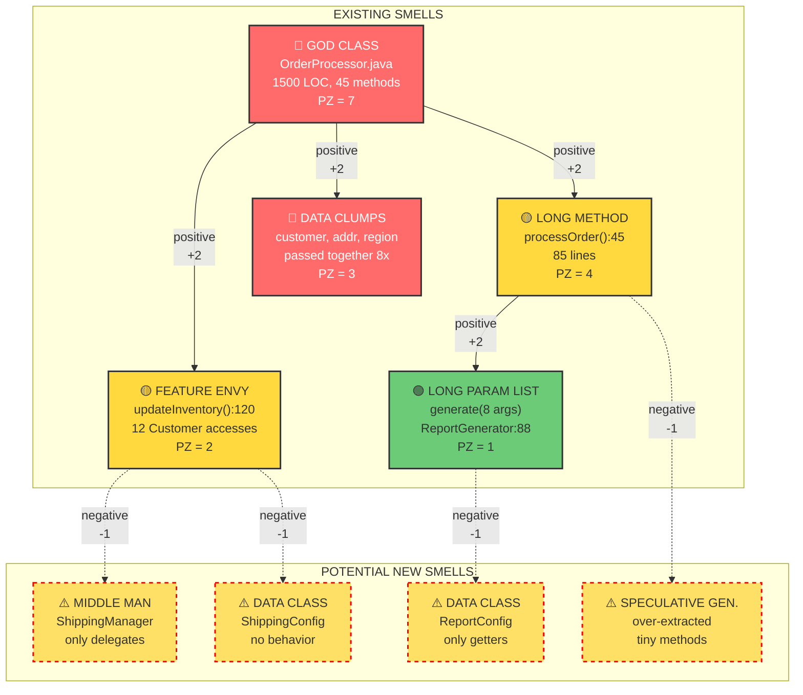
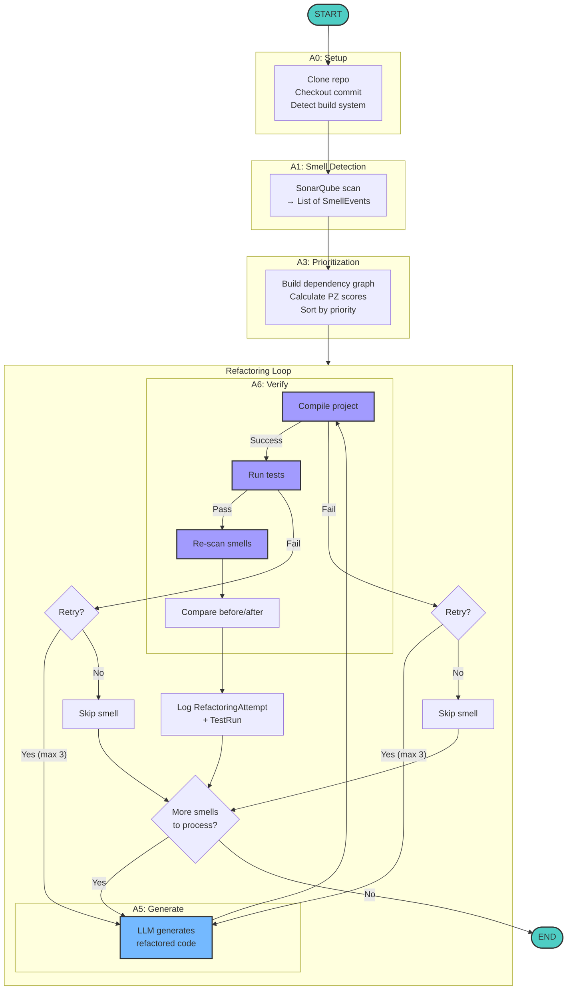
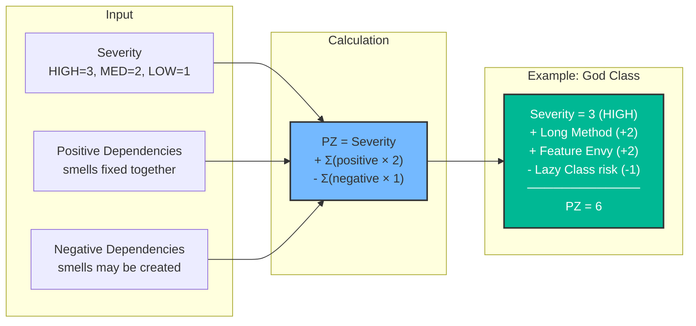
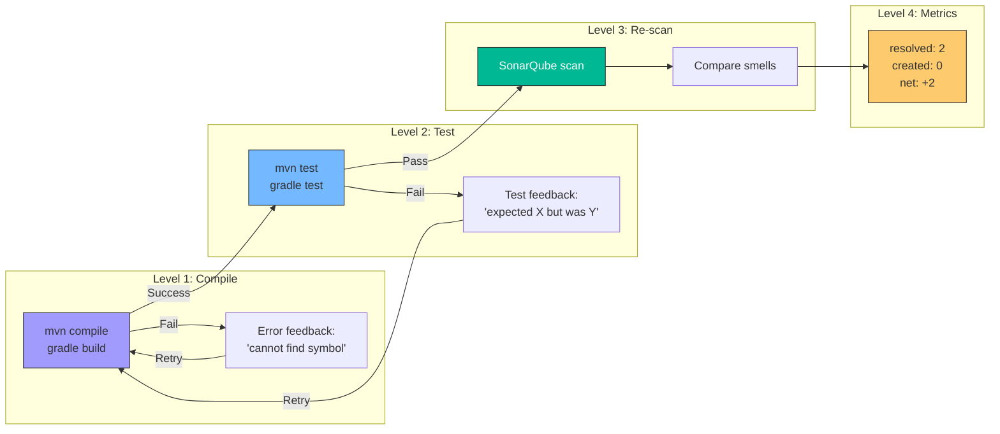
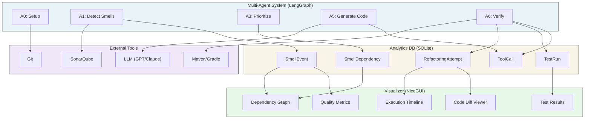
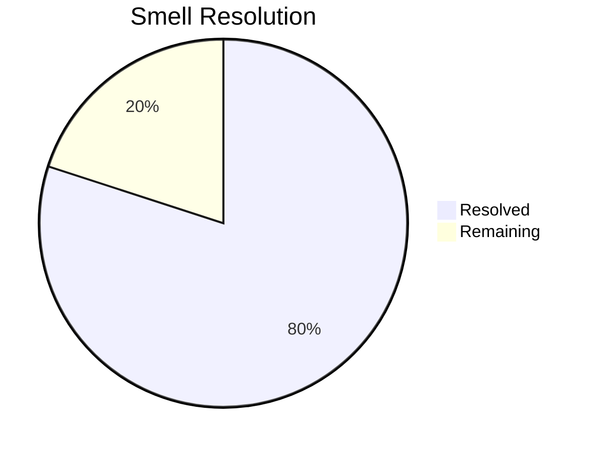
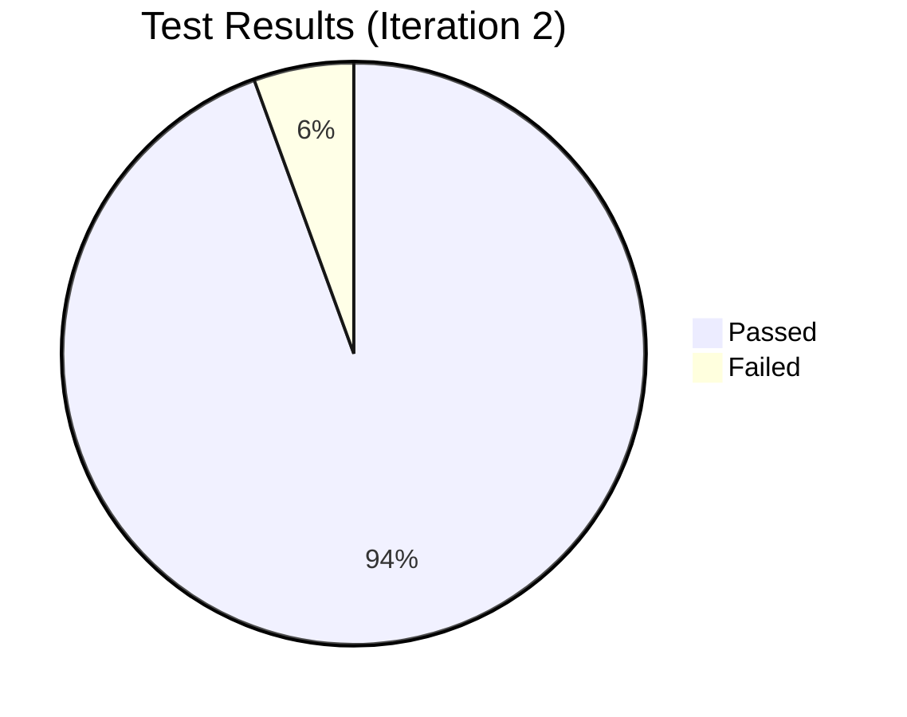

# SmellAI System - Mermaid Diagrams

## 1. Smell Dependency Graph

---

## 2. Agent Workflow (Composite Mode)

---

## 3. PZ Score Calculation

---

## 4. Verification Pipeline

---

## 5. Negative Dependency Cases

```mermaid
flowchart TD
    subgraph CASE1["Case 1: Extract Method → Speculative Generality"]
        LM1["Long Method<br/>processOrder() 85 lines"]
        LM1 -->|"Extract<br/>Method"| AFTER1["processOrder()<br/>calls step1..step5()"]
        AFTER1 -.->|"creates"| SG1["⚠️ Speculative Generality<br/>5 tiny methods, used once"]
    end

    subgraph CASE2["Case 2: Move Method → Middle Man"]
        FE1["Feature Envy<br/>accesses Customer 12x"]
        FE1 -->|"Move<br/>Method"| AFTER2["Delegates to<br/>ShippingManager"]
        AFTER2 -.->|"creates"| MM1["⚠️ Middle Man<br/>only delegates, no logic"]
    end

    subgraph CASE3["Case 3: Introduce Parameter Object → Data Class"]
        LP1["Long Parameter List<br/>generate(8 args)"]
        LP1 -->|"Introduce<br/>Param Object"| AFTER3["generate(ReportConfig)"]
        AFTER3 -.->|"creates"| DC1["⚠️ Data Class<br/>only getters, no behavior"]
    end

    subgraph CASE4["Case 4: Extract Class → Lazy Class"]
        GC1["God Class<br/>1500 lines, 45 methods"]
        GC1 -->|"Extract<br/>Class"| AFTER4["6 small classes<br/>1-2 methods each"]
        AFTER4 -.->|"creates"| LC1["⚠️ Lazy Classes<br/>too small, no cohesion"]
    end

    style LM1 fill:#ffd93d
    style FE1 fill:#ffd93d
    style LP1 fill:#6bcb77
    style GC1 fill:#ff6b6b,color:#fff

    style SG1 fill:#ffe066,stroke:#f00,stroke-dasharray: 5 5
    style MM1 fill:#ffe066,stroke:#f00,stroke-dasharray: 5 5
    style DC1 fill:#ffe066,stroke:#f00,stroke-dasharray: 5 5
    style LC1 fill:#ffe066,stroke:#f00,stroke-dasharray: 5 5
```

---

## 6. Data Flow Architecture

---

## 7. Demo Scenario Timeline

```mermaid
gantt
    title Demo Session: demo-2cf71c99
    dateFormat X
    axisFormat %s

    section Iteration 1
    Extract Method (Long Method)     :done, i1, 0, 10
    Compile                          :done, c1, 10, 12
    Run Tests (18/18 ✅)             :done, t1, 12, 15
    Re-scan Smells                   :done, s1, 15, 17

    section Iteration 2
    Move Method (Feature Envy)       :done, i2, 17, 27
    Compile                          :done, c2, 27, 29
    Run Tests (17/18 ❌)             :crit, t2, 29, 32
    Retry                            :done, r2, 32, 40
    Run Tests (18/18 ✅)             :done, t2b, 40, 43

    section Iteration 3
    Introduce Param Object           :done, i3, 43, 53
    Compile                          :done, c3, 53, 55
    Run Tests (18/18 ✅)             :done, t3, 55, 58
    Re-scan Smells                   :done, s3, 58, 60
```

---

## 8. Metrics Dashboard

---

## Legend

| Symbol | Meaning |
|--------|---------|
| 🔴 | HIGH severity smell |
| 🟡 | MEDIUM severity smell |
| 🟢 | LOW severity smell |
| ⚠️ | Potential new smell (risk) |
| `───▶` | Positive dependency (fixes together) |
| `- - ▶` | Negative dependency (may create) |
| ✅ | Success |
| ❌ | Failure |
