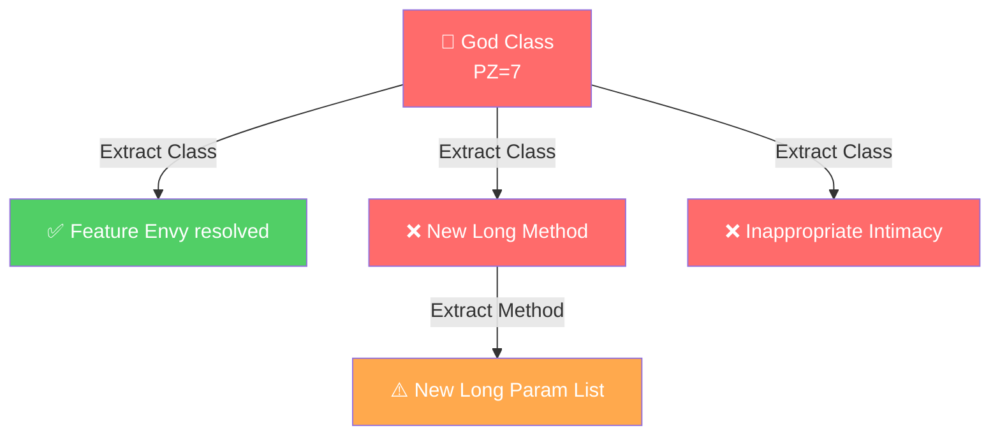
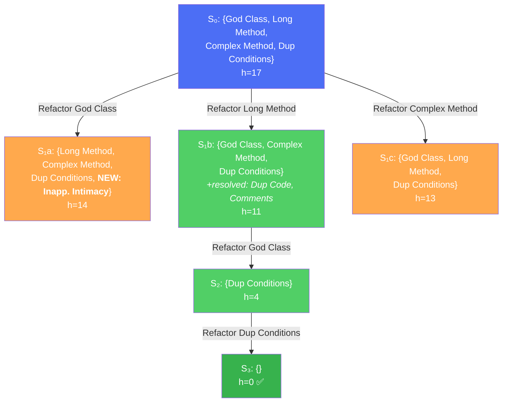
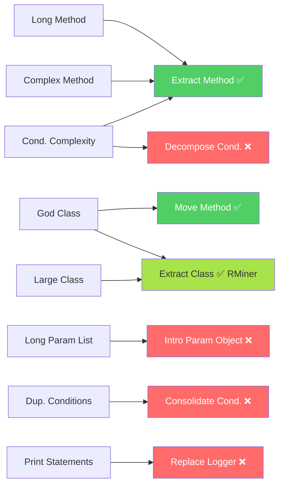
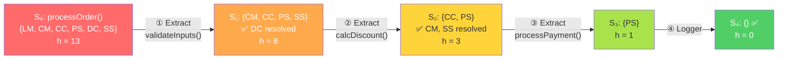
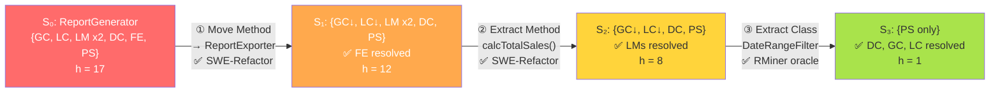
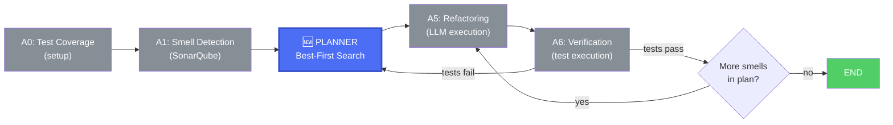
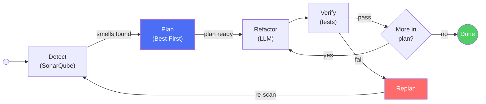
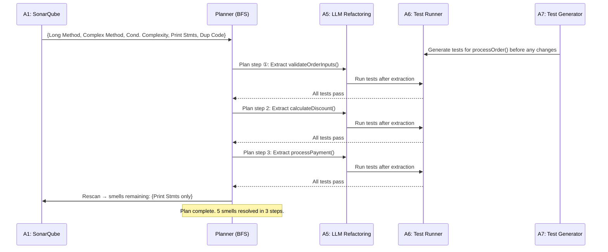

# Best-First Search Planning for Smell Refactoring

Introducing planning into the multi-agent refactoring workflow

Havriil Pietukhin

<style>
  .mermaid svg {
    max-height: 480px !important;
    width: auto !important;
  }
  .slidev-code {
    font-size: 0.82em !important;
    line-height: 1.35 !important;
  }
</style>

---

# Current approach: Greedy prioritization

The system currently uses a **greedy algorithm** to select the next smell to refactor.

$$PZ_i = Severity_i + \sum_{j \in \text{PositiveDeps}(i)} w_{\text{impact}}$$

**Algorithm:**
1. Compute PZ for all detected smells
2. Pick the smell with **maximum PZ**
3. Refactor it
4. Remove from graph, recalculate
5. Repeat

**Problem:** Greedy is **myopic** - it commits to each choice without foreseeing cascading effects.

---

# Why greedy falls short


<div class="grid grid-cols-2 gap-8">
<div>

**Scenario: God Class + Long Methods**

A God Class (PZ=7) is picked first. Refactoring it via Extract Class may:

- (+) Resolve Feature Envy, Data Clumps
- (-) **Create** new Long Methods in extracted classes
- (-) **Create** Inappropriate Intimacy

The newly created smells force additional unplanned refactorings.

</div>
<div>



</div>
</div>

---

# Proposed: Best-first search planning

Model the refactoring process as a **search problem** over the space of smell configurations.

| Component | Definition |
|-----------|-----------|
| **State** | Current set of smells S = {s₁, s₂, ..., sₙ} with severities |
| **Initial state** | S₀ = all smells detected by SonarQube |
| **Actions** | Apply refactoring r(sᵢ) to address smell sᵢ |
| **Transition** | S' = (S \ resolved(sᵢ)) ∪ created(sᵢ) |
| **Heuristic** | h(S) = Σ severity(s) - estimated_positive_impact |
| **Goal** | Minimize total remaining smell impact |

**Key advantage:** Can explore multiple paths and **backtrack** when negative dependencies make a path worse.

---

# Best-first search: how it works




Priority queue expands the node with **lowest h(S)** first.

Path: Long Method → God Class → Dup Conditions (h: 17→11→4→0)

---

# Greedy vs best-first: side by side

<div class="grid grid-cols-2 gap-4">
<div>

### Greedy path
```
Step 1: God Class (PZ=7)
  → creates Inapp. Intimacy
  → creates Long Method

Step 2: Long Method (PZ=6)
  → creates Long Param List

Step 3: Complex Method (PZ=6)
  → creates Long Param List

Step 4: Dup Conditions (PZ=4)
Step 5: Inapp. Intimacy (PZ=2)
Step 6: Long Param List x2 (PZ=2)
─────────────────────
Total steps: 7
New smells created: 3
```

</div>
<div>

### Best-first path
```
Step 1: Long Method (PZ=6)
  → resolves Dup Code, Comments
  → positive cascade!

Step 2: God Class (PZ=7)
  → fewer methods to extract
  → reduced negative impact

Step 3: Complex Method (PZ=6)
Step 4: Dup Conditions (PZ=4)
─────────────────────
Total steps: 4
New smells created: 0
```

</div>
</div>

Best-first search finds a shorter path by **avoiding paths that create new smells**.

---

# The heuristic function

The quality of best-first search depends on the **heuristic function** h(S).

$$h(S) = \sum_{s \in S} \text{severity}(s) - \alpha \cdot \text{positive\_deps}(s) + \beta \cdot \text{negative\_deps}(s)$$

Where:
- $\text{severity}(s)$: HIGH=3, MEDIUM=2, LOW=1
- $\text{positive\_deps}(s)$: count of smells that refactoring s would also resolve
- $\text{negative\_deps}(s)$: count of smells that refactoring s might create
- $\alpha, \beta$: tunable weights (default: $\alpha=2, \beta=1.5$)

**Properties:**
- **Admissible** if $\alpha$ is not too aggressive (never overestimates benefit)
- **Consistent** since positive/negative dependency counts are monotonic
- Reduces to greedy PZ when search depth = 1

---

# What smells do we detect?

Our SonarQube integration detects **8 smell types**:

| Smell Type | SonarQube Rule | Severity | Typical Refactoring |
|-----------|---------------|----------|-------------------|
| Long Method | java:S138 | HIGH | **Extract Method** |
| Complex Method | java:S1541 | HIGH | **Extract Method** / Decompose Conditional |
| Conditional Complexity | java:S1067 | MEDIUM | Replace Conditional / **Extract Method** |
| Long Parameter List | java:S107 | MEDIUM | Introduce Parameter Object |
| God Class | java:S1200 | HIGH | Extract Class / **Move Method** |
| Large Class | java:S110 | HIGH | Extract Class |
| Duplicated Conditions | java:S1871 | MEDIUM | Consolidate Conditional |
| Print Statements | java:S106 | LOW | Replace with Logger |

Bold = available in our datasets.

---

# What refactorings do the datasets have?

<div class="grid grid-cols-2 gap-4">
<div>

### RMiner oracle (549 commits, 188 repos)
15,562 refactorings (11,514 TP), **101 unique types**.

| Refactoring | Total | TP |
|------------|------:|---:|
| Rename Method | 1,161 | 400 |
| **Move Class** | 1,115 | 855 |
| **Extract Method** | 1,096 | 1,033 |
| **Move Method** | 1,067 | 266 |
| Change Variable Type | 910 | 811 |
| **Extract Variable** | 325 | 325 |
| **Extract And Move Method** | 295 | 127 |
| **Inline Method** | 149 | 120 |
| **Extract Class** | 108 | 108 |
| **Extract Superclass** | 80 | 72 |
| + 91 more types | ... | ... |

</div>
<div>

### SWE-Refactor dataset (1,099 records, 18 projects)
| Refactoring | Count |
|------------|------:|
| **Extract Method** | 441 |
| **Move Method** | 410 |
| Extract And Move Method | 142 |
| **Inline Method** | 71 |
| Move And Rename Method | 21 |
| Move And Inline Method | 14 |

Top projects: Guava (300), PMD (125), JUnit5 (105), Commons-IO (93), Checkstyle (91), Hibernate (63+89).

</div>
</div>

---

# Gap analysis: smells vs available refactorings




---

# Coverage summary

<div class="grid grid-cols-2 gap-8">
<div>

### Covered (green path)
- **Long Method** → Extract Method (SWE-Refactor: 441, RMiner: 1,033 TP)
- **Complex Method** → Extract Method (same datasets)
- **God Class** → Move Method (SWE-Refactor: 410) + Extract Class (RMiner: 108 TP)
- **Large Class** → Extract Class (RMiner: 108 TP) + Extract Superclass (72 TP)
- **Conditional Complexity** → Extract Method (workaround)

Both datasets together cover most method-level and some class-level refactorings.

</div>
<div>

### NOT covered (red path)
- **Long Parameter List** → Introduce Parameter Object (missing from both datasets)
- **Duplicated Conditions** → Consolidate Conditional (missing)
- **Print Statements** → Replace with Logger (missing, low priority)

Note: Extract Class is now covered by the full RMiner oracle (108 TP instances), significantly closing the gap for God Class / Large Class.

</div>
</div>

**Conclusion:** SWE-Refactor covers method-level refactorings. The full RMiner oracle adds **Extract Class (108 TP)**, **Extract Superclass (72 TP)**, and **91 more types**. Together they cover **6 of 8** smell types.

---

# Concrete Example 1: OrderProcessor.java

<style scoped>
pre { font-size: 0.78em; line-height: 1.4; }
</style>

From `tests/test_data/smell_cooccurrence/` — a 176-line method with **6 co-occurring smells**.

<div class="grid grid-cols-2 gap-4">
<div>

**SonarQube detects:**
- Long Method (java:S138) — 145 lines
- Complex Method (java:S1541) — nested switches
- Conditional Complexity (java:S1067)
- Print Statements (java:S106) — 15 instances
- *(Undetected: Duplicated Code, Switch Statement)*

</div>
<div>

```java
// processOrder() — 145 lines, 9 params
public boolean processOrder(
    String orderId, String customerId,
    List<String> productIds, List<Integer> quantities,
    List<BigDecimal> prices, String paymentMethod,
    String shippingAddress, String customerType,
    boolean isExpressShipping) {

  // Duplicated validation x3 blocks
  if (orderId == null || orderId.trim().isEmpty()) { ... }
  if (customerId == null || ...) { ... }
  if (productIds == null || ...) { ... }

  // Switch statement smell — discount logic
  switch (customerType) {
    case "PREMIUM": /* nested ifs */ break;
    case "GOLD":    /* nested ifs */ break;
    case "SILVER":  /* nested ifs */ break;
    ...
  }

  // Another switch — payment processing
  switch (paymentMethod) {
    case "CREDIT_CARD": ... break;
    case "PAYPAL": ... break;
    ...
  }
}
```

</div>
</div>

---

# OrderProcessor: Best-First Search Plan




Steps ①②③ use **Extract Method** — fully evaluable with SWE-Refactor dataset.
Step ④ (Replace with Logger) — no dataset ground truth, but trivially verifiable.

---

# OrderProcessor: Step ① Extract Validation

<style scoped>
pre { font-size: 0.78em; line-height: 1.4; }
</style>

<div class="grid grid-cols-2 gap-4">
<div>

**BEFORE** — duplicated validation in processOrder():
```java
public boolean processOrder(...) {
  System.out.println("Processing order: " + orderId);
  if (orderId == null || orderId.trim().isEmpty()) {
    System.out.println("Error: Invalid order ID");
    return false;
  }
  if (customerId == null || customerId.trim().isEmpty()) {
    System.out.println("Error: Invalid customer ID");
    return false;
  }
  if (productIds == null || productIds.isEmpty()) {
    System.out.println("Error: No products in order");
    return false;
  }
  if (quantities == null || quantities.isEmpty()) { ... }
  if (prices == null || prices.isEmpty()) { ... }
  if (paymentMethod == null || ...) { ... }
  if (shippingAddress == null || ...) { ... }

  // ... 100+ more lines of logic
}
```

</div>
<div>

**AFTER** — extracted validateOrderInputs():
```java
public boolean processOrder(...) {
  if (!validateOrderInputs(orderId, customerId,
      productIds, quantities, prices,
      paymentMethod, shippingAddress)) {
    return false;
  }
  // ... remaining logic (now shorter)
}

private boolean validateOrderInputs(
    String orderId, String customerId,
    List<String> productIds,
    List<Integer> quantities,
    List<BigDecimal> prices,
    String paymentMethod,
    String shippingAddress) {
  if (orderId == null || orderId.trim().isEmpty())
    return false;
  if (customerId == null || customerId.trim().isEmpty())
    return false;
  // ... consolidated validation
  return true;
}
```

**Resolves:** Long Method (partially), Duplicated Code

</div>
</div>

---

# OrderProcessor: Step ② Extract Discount Logic

<style scoped>
pre { font-size: 0.78em; line-height: 1.4; }
</style>

<div class="grid grid-cols-2 gap-4">
<div>

**BEFORE** — switch statement in processOrder():
```java
BigDecimal discount = BigDecimal.ZERO;
switch (customerType) {
  case "PREMIUM":
    if (subtotal.compareTo(new BigDecimal("200")) >= 0)
      discount = subtotal.multiply(
        new BigDecimal("0.15"));
    else if (subtotal.compareTo(DISCOUNT_THRESHOLD) >= 0)
      discount = subtotal.multiply(
        new BigDecimal("0.10"));
    else
      discount = subtotal.multiply(
        new BigDecimal("0.05"));
    System.out.println(
      "Premium discount: " + discount);
    break;
  case "GOLD":
    // ... 15 more lines
  case "SILVER":
    // ... 8 more lines
  case "REGULAR":
    // ... 8 more lines
}
```

</div>
<div>

**AFTER** — extracted calculateDiscount():
```java
// In processOrder():
BigDecimal discount =
  calculateDiscount(customerType, subtotal);

private BigDecimal calculateDiscount(
    String customerType, BigDecimal subtotal) {
  return switch (customerType) {
    case "PREMIUM" -> calculatePremiumDiscount(subtotal);
    case "GOLD"    -> calculateGoldDiscount(subtotal);
    case "SILVER"  -> calculateSilverDiscount(subtotal);
    case "REGULAR" -> calculateRegularDiscount(subtotal);
    default        -> BigDecimal.ZERO;
  };
}

private BigDecimal calculatePremiumDiscount(
    BigDecimal subtotal) {
  if (subtotal.compareTo(new BigDecimal("200")) >= 0)
    return subtotal.multiply(new BigDecimal("0.15"));
  if (subtotal.compareTo(DISCOUNT_THRESHOLD) >= 0)
    return subtotal.multiply(new BigDecimal("0.10"));
  return subtotal.multiply(new BigDecimal("0.05"));
}
```

**Resolves:** Complex Method, Switch Statement, Cond. Complexity

</div>
</div>

---

# OrderProcessor: Generated Tests

<style scoped>
pre { font-size: 0.75em; line-height: 1.4; }
</style>

Agent A7 (Test Generation) produces tests **before refactoring** to verify behavior preservation.

<div class="grid grid-cols-2 gap-4">
<div>

**Tests for extracted validateOrderInputs():**
```java
@Test
void shouldRejectNullOrderId() {
  assertFalse(processor.processOrder(
    null, "C1", List.of("P1"), List.of(1),
    List.of(BigDecimal.TEN), "CREDIT_CARD",
    "123 Main St", "REGULAR", false));
}

@Test
void shouldRejectEmptyProductList() {
  assertFalse(processor.processOrder(
    "O1", "C1", List.of(), List.of(),
    List.of(), "CREDIT_CARD",
    "123 Main St", "REGULAR", false));
}

@Test
void shouldAcceptValidOrder() {
  assertTrue(processor.processOrder(
    "O1", "C1", List.of("P1"), List.of(2),
    List.of(new BigDecimal("25.00")),
    "CREDIT_CARD", "123 Main St",
    "REGULAR", false));
}
```

</div>
<div>

**Tests for extracted calculateDiscount():**
```java
@Test
void premiumOver200Gets15Percent() {
  BigDecimal subtotal = new BigDecimal("300.00");
  BigDecimal discount =
    processor.calculateDiscount("PREMIUM", subtotal);
  assertEquals(
    new BigDecimal("45.00"), discount);
}

@Test
void goldOver150Gets12Percent() {
  BigDecimal subtotal = new BigDecimal("200.00");
  BigDecimal discount =
    processor.calculateDiscount("GOLD", subtotal);
  assertEquals(
    new BigDecimal("24.00"), discount);
}

@Test
void unknownTypeGetsNoDiscount() {
  BigDecimal discount =
    processor.calculateDiscount("VIP",
      new BigDecimal("500.00"));
  assertEquals(BigDecimal.ZERO, discount);
}
```

</div>
</div>

---

# Concrete Example 2: ReportGenerator.java (God Class)

<style scoped>
pre { font-size: 0.72em; line-height: 1.4; }
</style>

280-line God Class with **6 co-occurring smells** — multiple unrelated responsibilities.

<div class="grid grid-cols-2 gap-4">
<div>

**SonarQube detects:**
- God Class (java:S1200) — 12+ fields, 9+ methods
- Large Class (java:S110) — 280 lines
- Long Method (java:S138) — `generateCustomerReport()`
- Print Statements (java:S106) — in every method
- *(Undetected: Data Clumps, Feature Envy)*

**Data Clumps pattern** — same 4 params everywhere:
```java
// This signature repeats in 8+ methods:
generateSalesReport(Date startDate, Date endDate,
                    String region, String category)
generateCustomerReport(Date startDate, Date endDate,
                       String region, String category)
generateInventoryReport(Date startDate, Date endDate,
                        String region, String category)
formatReportHeader(Date startDate, Date endDate,
                   String region, String category)
calculateTotalSales(Date startDate, Date endDate,
                    String region, String category)
exportToCSV(filename, startDate, endDate, region, category)
exportToPDF(filename, startDate, endDate, region, category)
sendReportByEmail(recipient, startDate, endDate, region, category)
```

</div>
<div>

**Feature Envy** — methods work with external data:
```java
public String generateCustomerReport(
    Date startDate, Date endDate,
    String region, String category) {
  // Feature Envy: works with dbConnection, not own data
  customerData = dbConnection.fetchCustomerData(
    startDate, endDate, region, category);

  int totalCustomers = 0;
  int newCustomers = 0;
  BigDecimal totalRevenue = BigDecimal.ZERO;

  // Feature Envy: iterating external collection
  for (CustomerRecord customer : customerData) {
    totalCustomers++;
    if (customer.getFirstPurchaseDate()
        .after(startDate)) {
      newCustomers++;
    }
    totalRevenue = totalRevenue.add(
      customer.getTotalSpent());
  }
  // ... 20 more lines of string building
}
```

**Responsibilities mixed in one class:**
Reporting + Formatting + Calculation + Data Access + Export (CSV/PDF/Email)

</div>
</div>

---

# ReportGenerator: Best-First Search Plan




Steps ①② are **evaluable** (Move Method, Extract Method in SWE-Refactor).
Step ③ (Extract Class for Data Clumps) has **no ground truth** — must rely on SonarQube rescan.

---

# ReportGenerator: Step ① Move Method (Feature Envy)

<style scoped>
pre { font-size: 0.75em; line-height: 1.4; }
</style>

<div class="grid grid-cols-2 gap-4">
<div>

**BEFORE** — export methods live in ReportGenerator:
```java
public class ReportGenerator {
  // ... 12 fields, 9 methods

  public void exportToCSV(String filename,
      Date startDate, Date endDate,
      String region, String category) {
    System.out.println("Exporting to CSV: " + filename);
    FileWriter writer = new FileWriter(filename);
    writer.write(generateSalesReport(
      startDate, endDate, region, category));
    writer.close();
  }

  public void exportToPDF(String filename,
      Date startDate, Date endDate,
      String region, String category) {
    System.out.println("Exporting to PDF: " + filename);
    PDFGenerator pdf = new PDFGenerator();
    pdf.addContent(generateSalesReport(
      startDate, endDate, region, category));
    pdf.save(filename);
  }

  public void sendReportByEmail(String recipient, ...) {
    EmailService email = new EmailService();
    email.send(recipient, "Sales Report", ...);
  }
}
```

</div>
<div>

**AFTER** — Move Method to new ReportExporter:
```java
public class ReportExporter {
  private final ReportGenerator generator;

  public ReportExporter(ReportGenerator generator) {
    this.generator = generator;
  }

  public void exportToCSV(String filename,
      Date startDate, Date endDate,
      String region, String category) {
    FileWriter writer = new FileWriter(filename);
    writer.write(generator.generateSalesReport(
      startDate, endDate, region, category));
    writer.close();
  }

  public void exportToPDF(String filename, ...) {
    PDFGenerator pdf = new PDFGenerator();
    pdf.addContent(generator.generateSalesReport(...));
    pdf.save(filename);
  }

  public void sendReportByEmail(String recipient, ...) {
    EmailService email = new EmailService();
    email.send(recipient, "Sales Report",
      generator.generateSalesReport(...));
  }
}
```

**Resolves:** Feature Envy, reduces God Class coupling

</div>
</div>

---

# Real Dataset: EduStepicConnector (RMiner)

<style scoped>
pre { font-size: 0.72em; line-height: 1.4; }
</style>

From **RMiner dataset** — real Extract Method from JetBrains IntelliJ (commit `7ed3f27`).

<div class="grid grid-cols-2 gap-4">
<div>

**BEFORE** — getCourses() has inline logic:
```java
@NotNull
public static List<CourseInfo> getCourses() {
  try {
    List<CourseInfo> result = new ArrayList<>();
    final List<CourseInfo> courseInfos =
      getFromStepic("courses", CoursesContainer.class)
        .courses;
    for (CourseInfo info : courseInfos) {
      final String courseType = info.getType();
      if (StringUtil.isEmptyOrSpaces(courseType))
        continue;
      final List<String> typeLanguage =
        StringUtil.split(courseType, " ");
      if (typeLanguage.size() == 2
          && PYCHARM_PREFIX.equals(typeLanguage.get(0))) {
        result.add(info);
      }
    }
    return result;
  } catch (IOException e) {
    LOG.error("Cannot load course list "
      + e.getMessage());
  }
  return Collections.emptyList();
}
```

Single-page fetch only. No pagination support.

</div>
<div>

**AFTER** — Extract Method + pagination:
```java
@NotNull
public static List<CourseInfo> getCourses() {
  try {
    List<CourseInfo> result = new ArrayList<>();
    int pageNumber = 0;
    boolean hasNext =
      addCoursesFromStepic(result, pageNumber);
    while (hasNext) {
      pageNumber += 1;
      hasNext =
        addCoursesFromStepic(result, pageNumber);
    }
    return result;
  } catch (IOException e) {
    LOG.error("Cannot load course list "
      + e.getMessage());
  }
  return Collections.emptyList();
}

private static boolean addCoursesFromStepic(
    List<CourseInfo> result, int pageNumber)
    throws IOException {
  final String url = pageNumber == 0
    ? "courses"
    : "courses?page=" + String.valueOf(pageNumber);
  final CoursesContainer coursesContainer =
    getFromStepic(url, CoursesContainer.class);
  final List<CourseInfo> courseInfos =
    coursesContainer.courses;
  for (CourseInfo info : courseInfos) { /* filter */ }
  return coursesContainer.meta.containsKey("has_next")
    && coursesContainer.meta.get("has_next") == TRUE;
}
```

**Refactoring:** Extract Method + Extract Variable

</div>
</div>

---

# Real Dataset: ScrollableToolbarPopupMenu (RMiner)

<style scoped>
pre { font-size: 0.78em; line-height: 1.4; }
</style>

From **RMiner dataset** — real Extract Method from RStudio (commit `cb49e43`).

<div class="grid grid-cols-2 gap-4">
<div>

**BEFORE** — inline style manipulation:
```java
@Override
protected Widget wrapMenuBar(ToolbarMenuBar menuBar) {
  scrollPanel_ = new ScrollPanel(menuBar);
  scrollPanel_.addStyleName(
    ThemeStyles.INSTANCE.scrollableMenuBar());
  scrollPanel_.getElement().getStyle()
    .setOverflowY(Overflow.AUTO);
  scrollPanel_.getElement().getStyle()
    .setOverflowX(Overflow.HIDDEN);
  scrollPanel_.getElement().getStyle()
    .setProperty("maxHeight", getMaxHeight() + "px");
  return scrollPanel_;
}
```

Height setting is embedded in widget creation — can't be changed later.

</div>
<div>

**AFTER** — extracted setMaxHeight():
```java
@Override
protected Widget wrapMenuBar(ToolbarMenuBar menuBar) {
  scrollPanel_ = new ScrollPanel(menuBar);
  scrollPanel_.addStyleName(
    ThemeStyles.INSTANCE.scrollableMenuBar());
  scrollPanel_.getElement().getStyle()
    .setOverflowY(Overflow.AUTO);
  scrollPanel_.getElement().getStyle()
    .setOverflowX(Overflow.HIDDEN);
  setMaxHeight(getMaxHeight());
  return scrollPanel_;
}

protected void setMaxHeight(int maxHeight) {
  scrollPanel_.getElement().getStyle()
    .setProperty("maxHeight", maxHeight + "px");
}
```

Now subclasses can dynamically adjust height.

</div>
</div>

**This is exactly what the LLM agent must produce** — matching this ground truth is how we evaluate.

---

# Test Generation for Behavior Preservation

<style scoped>
pre { font-size: 0.72em; line-height: 1.4; }
</style>

Agent A7 generates tests **before** refactoring, Agent A6 runs them **after** each step.

<div class="grid grid-cols-2 gap-4">
<div>

**For EduStepicConnector (Extract Method):**
```java
@Test
void getCoursesReturnsFilteredPycharmCourses() {
  // Setup: mock getFromStepic to return test data
  CourseInfo pycharm = new CourseInfo();
  pycharm.setType("pycharm python");
  CourseInfo other = new CourseInfo();
  other.setType("java basics");

  // Before refactoring: single page
  List<CourseInfo> courses = getCourses();
  assertFalse(courses.isEmpty());
  assertTrue(courses.stream()
    .allMatch(c -> c.getType()
      .startsWith("pycharm")));
}

@Test
void getCoursesReturnsEmptyOnIOException() {
  // Mock: getFromStepic throws IOException
  List<CourseInfo> courses = getCourses();
  assertTrue(courses.isEmpty());
}
```

After refactoring, **same tests must still pass** with the new pagination-enabled `addCoursesFromStepic()`.

</div>
<div>

**For ReportGenerator (Move Method):**
```java
@Test
void exportToCSVProducesSameOutput() {
  ReportGenerator gen = createTestGenerator();
  Date start = parseDate("2024-01-01");
  Date end = parseDate("2024-12-31");

  // Capture original output
  String report = gen.generateSalesReport(
    start, end, "US", "electronics");

  // After Move Method: use ReportExporter
  ReportExporter exporter =
    new ReportExporter(gen);
  exporter.exportToCSV("/tmp/test.csv",
    start, end, "US", "electronics");

  String exported = readFile("/tmp/test.csv");
  assertEquals(report, exported);
}

@Test
void emailContainsSameReportContent() {
  // Verify sendReportByEmail produces
  // identical content after Move Method
  ReportExporter exporter =
    new ReportExporter(gen);
  // Mock EmailService, verify body matches
  exporter.sendReportByEmail("test@test.com",
    start, end, "US", "electronics");
  verify(emailService).send(
    eq("test@test.com"), anyString(),
    eq(expectedReport));
}
```

</div>
</div>

---

# PaymentValidator: Duplicated Conditions Example

<style scoped>
pre { font-size: 0.72em; line-height: 1.4; }
</style>

206-line class with **near-identical validation** repeated 4 times — a dataset gap scenario.

<div class="grid grid-cols-2 gap-4">
<div>

**The problem** — same null checks in every method:
```java
// validateCreditCardPayment():
if (cardNumber == null || cardNumber.trim().isEmpty())
  return false;
if (amount == null ||
    amount.compareTo(MIN_AMOUNT) < 0) return false;
if (amount.compareTo(MAX_AMOUNT) > 0) return false;

// validateDebitCardPayment() — IDENTICAL:
if (cardNumber == null || cardNumber.trim().isEmpty())
  return false;
if (amount == null ||
    amount.compareTo(MIN_AMOUNT) < 0) return false;
if (amount.compareTo(MAX_AMOUNT) > 0) return false;

// validatePayPalPayment() — SAME pattern:
if (email == null || email.trim().isEmpty())
  return false;
if (amount == null ||
    amount.compareTo(MIN_AMOUNT) < 0) return false;
if (amount.compareTo(MAX_AMOUNT) > 0) return false;

// validateBankTransfer() — AGAIN:
if (accountNumber == null || ...) return false;
if (amount == null || ...) return false;
```

Also: `determinePaymentRisk()` and `requiresAdditionalVerification()` have **nearly identical** nested conditional logic.

</div>
<div>

**Ideal refactoring** (no dataset ground truth):
```java
// Extract common validation
private boolean validateAmount(BigDecimal amount) {
  return amount != null
    && amount.compareTo(MIN_AMOUNT) >= 0
    && amount.compareTo(MAX_AMOUNT) <= 0;
}

private boolean validateRequired(String... fields) {
  return Arrays.stream(fields)
    .allMatch(f -> f != null && !f.trim().isEmpty());
}

// Simplified methods:
public boolean validateCreditCardPayment(
    String cardNumber, String cvv,
    Date expiryDate, BigDecimal amount,
    String cardHolder) {
  if (!validateRequired(cardNumber, cvv, cardHolder))
    return false;
  if (!validateAmount(amount)) return false;
  if (expiryDate == null
      || expiryDate.before(new Date()))
    return false;
  return cardNumber.length() >= 13
    && cardNumber.length() <= 19
    && (cvv.length() == 3 || cvv.length() == 4);
}
```

**This refactoring (Consolidate Conditional) is NOT in either dataset.** Evaluation must rely on SonarQube rescan + test pass rate.

</div>
</div>

---

# Dependency rules powering the search

The search uses **Markovič & Polášek dependency rules** as its transition model.

<div class="grid grid-cols-2 gap-4 text-sm">
<div>

### Positive dependencies (resolves)
| Refactoring target | May also resolve |
|---|---|
| Long Method | Switch Statement, Feature Envy, Duplicated Code, Divergent Change, Comments, Long Param List |
| Complex Method | (same as Long Method) |
| Conditional Complexity | (same as Long Method) |
| Long Param List | Long Param List, Data Clumps |
| Large Class / God Class | Data Clumps, Feature Envy, Bad Class Content |
| Duplicated Conditions | Divergent Change, Shotgun Surgery |

</div>
<div>

### Negative dependencies (creates)
| Refactoring target | May create |
|---|---|
| Long Method | Long Method, Long Param List |
| Complex Method | Long Method, Long Param List |
| Long Param List | Data Class |
| Large Class / God Class | Long Method, Data Class, Inappropriate Intimacy, Message Chains |
| Duplicated Conditions | Large Class, Bad Inheritance |

</div>
</div>

---

# Integration into the agentic workflow




**The planner replaces the greedy algorithm** in Agent 4 (Smell Prioritization).

Key change: Instead of a single priority queue, the planner produces an **ordered plan** — a sequence of (smell, refactoring) pairs — optimized for minimal total negative impact.

---

# Planner: replanning on failure


When verification fails, the planner **replans** from the current state.



**Replan triggers:**
1. Test failure after refactoring (rollback + rescan + replan)
2. New smells detected that weren't predicted by dependency rules
3. Predicted positive dependencies didn't materialize

---

# What we CAN evaluate today

Given current dataset coverage, the planner can be evaluated for these smell combinations:

| Scenario | Smells Involved | Refactoring | Dataset |
|----------|----------------|-------------|---------|
| Long Method cluster | Long Method + Complex Method + Cond. Complexity | Extract Method chain | SWE-Refactor (441) |
| God Class decomposition | God Class + Feature Envy | Move Method series | SWE-Refactor (410) |
| Class-level decomposition | God Class + Large Class | Extract Class | RMiner oracle (108 TP) |
| Method extraction cascade | Long Method resolves Dup Code | Extract Method | RMiner (1,033 TP) + SWE-Refactor |
| Compound refactoring | Long Method + Feature Envy | Extract And Move Method | SWE-Refactor (142) + RMiner (127 TP) |
| Inline dead code | Middle Man / unnecessary delegation | Inline Method | SWE-Refactor (71) + RMiner (120 TP) |
| Inheritance refactoring | Large Class with shared behavior | Extract Superclass | RMiner oracle (72 TP) |

These cover **6 of 8** detected smell types with ground truth.

---

# What we CANNOT evaluate today

| Missing Refactoring | Needed For | Impact |
|---------------------|-----------|--------|
| **Introduce Parameter Object** | Long Parameter List | No ground truth for parameter grouping |
| **Consolidate Conditional** | Duplicated Conditions | No ground truth for condition merging |
| **Decompose Conditional** | Conditional Complexity | Must use Extract Method as workaround |
| **Replace with Logger** | Print Statements | Trivial refactoring, low priority |

**Previously missing, now covered by RMiner oracle:**
- Extract Class (108 TP) — for God Class / Large Class decomposition
- Extract Superclass (80 total, 72 TP) — for inheritance-based decomposition
- Merge Parameter (28 TP) — partial coverage for Long Parameter List

---

# Proposed evaluation strategy

<div class="grid grid-cols-2 gap-8">
<div>

### Phase 1: Method-level planning
*Using existing datasets*

- Evaluate best-first vs greedy on **Long Method / Complex Method / Conditional Complexity** clusters
- Use SWE-Refactor Extract Method ground truth
- Measure: steps needed, new smells created, compile+test success rate

</div>
<div>

### Phase 2: Class-level planning
*Using RMiner oracle (108 Extract Class, 72 Extract Superclass TP)*

- Evaluate best-first vs greedy on **God Class / Large Class** scenarios
- Use RMiner oracle Extract Class ground truth
- Remaining gaps (Introduce Parameter Object, Consolidate Conditional): evaluate via SonarQube rescan

</div>
</div>

**Metrics for planning quality:**
- Plan efficiency: steps executed / smells resolved
- Negative dependency rate: new smells created / refactorings applied
- Backtrack rate: replans triggered / total executions

---

# End-to-end walkthrough: OrderProcessor




---

# Real scenario: IntelliJ AbstractExternalFilter (RMiner)

<style scoped>
pre { font-size: 0.75em; line-height: 1.4; }
</style>

Commit `7a4dab88` applies **7 refactoring types** across 4 files. The agent must decide what to fix first.

<div class="grid grid-cols-2 gap-4">
<div>

**Smells detected in `AbstractExternalFilter.java`:**

| Smell | Location | Severity |
|-------|----------|----------|
| Long Method | `doBuildFromStream()` ~120 lines | HIGH |
| Complex Method | nested loops + conditionals in same method | HIGH |
| Data Clumps | `Trinity<Pattern, Pattern, Boolean>` used as return/param everywhere | MEDIUM |

**Multiple valid refactoring paths:**

- **Path A:** Extract Method on `doBuildFromStream()` first (reduces Long Method + Complex Method)
- **Path B:** Extract Class `ParseSettings` from `Trinity` first (resolves Data Clumps across hierarchy)
- **Path C:** Inline Method + Change Return Type first (type cleanup before structural changes)

</div>
<div>

**What the developers actually did (ground truth):**

```java
// BEFORE: opaque tuple
protected Trinity<Pattern, Pattern, Boolean>
    getParseSettings(@NotNull String url) {
  return Trinity.create(defined_pattern,
    defined_pattern2, false);
}
// Callers use settings.first, settings.second, settings.third

// AFTER: named class extracted
protected ParseSettings
    getParseSettings(@NotNull String url) {
  return new ParseSettings(defined_pattern,
    defined_pattern2, false);
}
// Callers use settings.startPattern, settings.endPattern

// New class (Extract Class):
static class ParseSettings {
  final Pattern startPattern;
  final Pattern endPattern;
  final boolean useDt;
  ParseSettings(Pattern start, Pattern end,
                boolean useDt) { ... }
}
```

Developers chose **Path B** — fixing Data Clumps first improved readability before tackling the Long Method.

</div>
</div>

---

# Real scenario: IntelliJ Debugger (RMiner)

<style scoped>
pre { font-size: 0.75em; line-height: 1.4; }
</style>

Commit `76552001` refactors **9 files** in the debugger subsystem. Agent faces a cross-file choice.

<div class="grid grid-cols-2 gap-4">
<div>

**Smells spanning multiple files:**

| Smell | Files Affected | Severity |
|-------|---------------|----------|
| Long Parameter List | `DebuggerSession`, `BreakpointManager`, `DebugProcessImpl` | HIGH |
| Primitive Obsession | same 3 files — `(Document, int)` instead of `XSourcePosition` | MEDIUM |
| Extract Method needed | `RemappedSourcePosition.getLine()`, `.getOffset()` | MEDIUM |

**The choice:** fix parameters first, or extract methods first?

- **Path A:** Merge Parameter `(Document, int)` → `XSourcePosition` across all callers first, then extract methods
- **Path B:** Extract Method `checkRemap()` in `RemappedSourcePosition` first, then fix parameter lists

</div>
<div>

**BEFORE — Long Parameter List:**
```java
// DebuggerSession.java
public void runToCursor(
    Document document,    // primitive pair
    int line,             // instead of position object
    final boolean ignoreBreakpoints) { ... }

// BreakpointManager.java
public RunToCursorBreakpoint addRunToCursorBreakpoint(
    Document document,    // same primitive pair
    int lineIndex,        // duplicated across files
    final boolean ignoreBreakpoints) { ... }
```

**AFTER — Merge Parameter (Introduce Parameter Object):**
```java
// DebuggerSession.java
public void runToCursor(
    @NotNull XSourcePosition position,
    final boolean ignoreBreakpoints) { ... }

// BreakpointManager.java
public RunToCursorBreakpoint addRunToCursorBreakpoint(
    @NotNull XSourcePosition position,
    final boolean ignoreBreakpoints) { ... }
```

Developers chose **Path A** — parameter cleanup first, because it touched the public API and cascaded to all callers.

</div>
</div>

---

# How the planner calculates the best first step


Concrete calculation for the **IntelliJ AbstractExternalFilter** scenario.

**Initial state S0:** {Long Method (H=3), Complex Method (H=3), Data Clumps (M=2)}

$$h(S) = \sum \text{severity}(s) - \alpha \cdot |\text{positive\_deps}| + \beta \cdot |\text{negative\_deps}|$$

| Action | Resolves | Creates | h(S') calculation | h(S') |
|--------|----------|---------|-------------------|-------|
| **Extract Method on doBuildFromStream()** | Long Method, Complex Method (+resolves: Dup Code, Comments via positive deps) | may create Long Param List | (2) - 2(2) + 1.5(1) | **-0.5** |
| **Extract Class ParseSettings** | Data Clumps (+resolves: Feature Envy via God Class positive deps) | may create Data Class | (3+3) - 2(1) + 1.5(1) | **5.5** |
| **Change Return Type only** | none directly | none | (3+3+2) - 0 + 0 | **8.0** |

**Planner picks:** Extract Method (h = -0.5, lowest), because it resolves the most smells with fewest negative effects.

But developers chose Extract Class first. Why? Because **cross-file impact** matters — the `Trinity` type appeared in the entire class hierarchy. The heuristic can be improved by adding a **scope multiplier** for changes that cascade across files:

$$h'(S) = h(S) - \gamma \cdot \text{files\_affected}(s)$$

---

# SWE-Refactor: compound refactoring choices

<style scoped>
pre { font-size: 0.75em; line-height: 1.4; }
</style>

SWE-Refactor contains **3 compound types** where the agent must decompose a multi-step refactoring.

<div class="grid grid-cols-2 gap-4">
<div>

**Extract And Move Method** — two operations in one:

The agent detects Long Method + Feature Envy in the same method. Two valid orderings:

| Order | Step 1 | Step 2 |
|-------|--------|--------|
| A | Extract Method (reduce length) | Move Method (fix envy) |
| B | Move Method (fix envy first) | Extract in target class |

The planner evaluates both:
- Order A: after extraction, the shorter method may no longer exhibit Feature Envy (positive cascade), making Move unnecessary
- Order B: moving the long method brings the smell into a new class, still needs extraction

**Planner chooses Order A** — Extract first has higher chance of resolving both smells in fewer steps.

</div>
<div>

**Move And Inline Method** — opposing forces:

The agent detects Feature Envy + unnecessary delegation. The method should be moved to where it belongs, then inlined into its only caller.

| Order | Step 1 | Step 2 | Risk |
|-------|--------|--------|------|
| A | Move Method | Inline Method | Safe: move first, then simplify |
| B | Inline Method | Move (now larger) | Risky: inlining may create Long Method in wrong class |

The planner's heuristic penalizes Order B:

```
Order A: h = severity(FE) + severity(MM)
         - alpha * 2 (both resolved) + 0
Order B: h = severity(FE) + severity(MM)
         - alpha * 1 + beta * 1 (Long Method risk)
```

Order A always wins because it avoids creating new smells.

</div>
</div>
